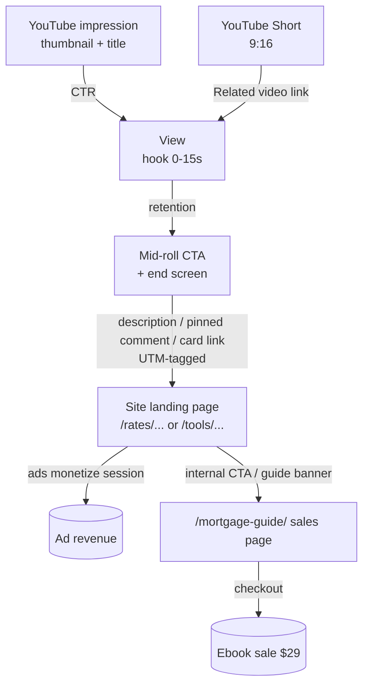
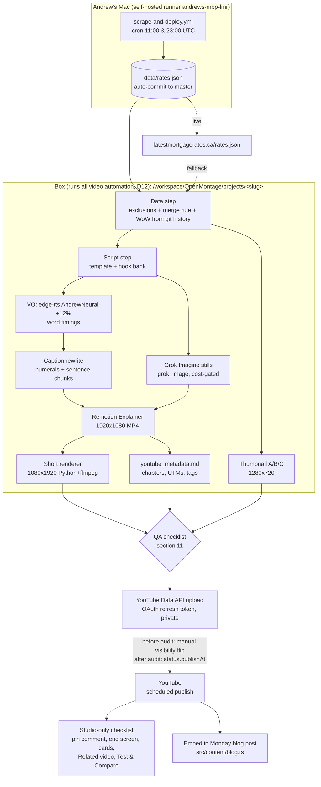

# Latest Mortgage Rates: Video Reference Document

**Brand:** Latest Mortgage Rates (LMR) · https://latestmortgagerates.ca
**Owner:** Andrew
**Repo:** `drewbotcarrothers/latestmortgagerates` (default branch `master`)
**Document status:** v1.1 · updated Sunday, September 27, 2026 (ET). All 15 open questions are now resolved decisions (§14)
**Scope:** YouTube long-form (16:9) and YouTube Shorts (9:16) only. Cross-posting comes later (D15). This covers planning, scripting, production, packaging and publishing. It does not cover rendering any particular episode.

> **Read this before you script, run TTS, build Remotion props, make a thumbnail, or upload any LMR video.** It is the single source of truth for LMR video. It lives in the repo at `video-pipeline/LMR_VIDEO_REFERENCE.md` and **replaces** `video-pipeline/openmontage/VIDEO-RULES.md` (2026-09-15), which is deleted when this document lands (decision D13). Where this document cites "repo VIDEO-RULES §n", it means that retired file as of commit `88f0594`. Its rules are carried over here.

---

## Table of contents

1. [Purpose, goals and KPIs](#1-purpose-goals-and-kpis)
2. [Sources used for this document](#2-sources-used-for-this-document)
3. [Global standards (all videos)](#3-global-standards-all-videos)
4. [Formats](#4-formats)
5. [Video Type 1: Weekly Latest Mortgage Rates](#5-video-type-1-weekly-latest-mortgage-rates)
6. [Video Type 2: Interest Rate News](#6-video-type-2-interest-rate-news)
7. [Video Type 3: Mortgage Tool demos](#7-video-type-3-mortgage-tool-demos)
8. [Thumbnails](#8-thumbnails)
9. [Metadata and SEO](#9-metadata-and-seo)
10. [Pipeline and automation architecture](#10-pipeline-and-automation-architecture)
11. [QA checklist (before publishing)](#11-qa-checklist-before-publishing)
12. [Publishing calendar: first 4 weeks](#12-publishing-calendar-first-4-weeks)
13. [Data gaps, known issues and the insured-label audit](#13-data-gaps-known-issues-and-the-insured-label-audit)
14. [Decisions (all resolved)](#14-decisions-all-resolved)
15. [Appendix](#15-appendix)

---

## 1. Purpose, goals and KPIs

### 1.1 Purpose

LMR video exists to **send qualified Canadian mortgage shoppers to latestmortgagerates.ca**. The site earns money two ways:

1. **Display advertising** on rate, tool and blog pages. Revenue scales with sessions and pageviews.
2. **Sales of the $29 digital ebook**, *The Guide to Getting the Best Deal on Your Next Mortgage* (https://latestmortgagerates.ca/mortgage-guide/). It has 10 chapters, is a PDF, comes with a 30-day refund promise, and is updated quarterly (all per the live sales page, fetched 2026-09-27).

YouTube is a **top-of-funnel discovery channel**. Every video should earn trust with real, dated, sourced rate data, then give the viewer a specific reason to click through: the full rate board, a calculator, or the guide.

### 1.2 Goals (first 90 days)

| # | Goal | Why |
|---|------|-----|
| G1 | Publish a reliable weekly rates show every Monday, with a companion Short | Consistency builds session habit and search surface area ("mortgage rates this week Canada") |
| G2 | Cover every scheduled Bank of Canada decision the same day | These are the biggest search and attention spikes in Canadian mortgages |
| G3 | Ship one demo video for each of the 10 site calculators | Evergreen search traffic that lands directly on tool pages (ad inventory) |
| G4 | Drive measurable, UTM-tracked sessions to the site and to `/mortgage-guide/` | Proves YouTube ROI in GA/Search Console, not just in YouTube Studio |

### 1.3 Funnel: video to site to ebook



### 1.4 KPIs and targets

The site baseline comes from Search Console's 28-day Performance view (screenshot at `/workspace/gsc/perf-28d.png`, window about 2026-08-16 to 2026-09-13): **8 clicks, 5.71K impressions, 0.1% CTR, average position 37.9**. Organic search traffic is still tiny, so YouTube-referred sessions will be easy to see in analytics.

| Stage | KPI | Where to read it | Initial target (first 90 days) | Notes |
|------|-----|------------------|-------------------------------|-------|
| Packaging | Impressions CTR (long-form) | YouTube Studio → Reach | ≥ 4% by week 8 | Small finance channels usually sit at 2-6%. Use Test & Compare (§8.4) |
| Hook | % still watching at 0:30 | Studio → Engagement → Audience retention ("key moments") | ≥ 65% | Target intro drop-off < 35% |
| Retention | Average percentage viewed (long-form) | Studio → Engagement | ≥ 40% on the ≈ 8-9 min weekly | Weekly show is list content, so chapter skipping is expected |
| Retention | Shorts "viewed vs swiped away" | Studio → Shorts analytics | ≥ 60% viewed | |
| Click-out | YouTube-referred sessions | GA / site analytics, `utm_source=youtube` | 50 sessions/week by week 8 | UTMs on every link (§9.6) |
| Click-out | Sessions per 1,000 views | Sessions ÷ views × 1000 | ≥ 10 | Our own north-star ratio for video to site |
| Monetize | Guide page visits from YouTube | Analytics, `utm_campaign=*` landing `/mortgage-guide/` | Track from day 1 | |
| Monetize | Guide sales attributed to YouTube | Checkout + `ref=youtube` + UTM | First attributed sale by week 6 | Every ebook link carries `ref=youtube` plus UTMs (D8, §9.6) |
| Growth | Subscribers per 1,000 views | Studio | ≥ 5 | |

**Review cadence:** every Friday, a 15-minute review of the week's CTR, 30-second retention, and UTM sessions. Log it in `/workspace/lmr-video/kpi-log.csv` (to be created).

---

## 2. Sources used for this document

All settings below come from real files and pages. Nothing is invented. Where something could not be found, the document says so.

| Topic | Source (path or URL) |
|------|----------------------|
| StockSummarizer workflow | `/home/box/agent-data/workflows/stocksummarizer-stock-video/SKILL.md` |
| StockSummarizer VO + caption rules (source of truth) | `/workspace/stocksummarizer/brand/STOCK-ANALYSIS-VIDEO-REFERENCE.md` (last updated 2026-09-26), §2.1, §4, §5, §6.3, §7.5, §8 |
| StockSummarizer caption render values (actual props) | `/workspace/OpenMontage/projects/cco-westinghouse-ipo-stake/public/remotion_props_v1.json` and `/workspace/OpenMontage/projects/shop-agentic-checkout-premium/public/remotion_props_v3.json` (`themeConfig`) |
| StockSummarizer style playbook | `/workspace/OpenMontage/styles/stocksummarizer.yaml` |
| Caption renderer (landscape) | `/workspace/OpenMontage/remotion-composer/src/components/CaptionOverlay.tsx` + `src/Explainer.tsx` (caption layer) |
| Caption renderer (9:16 Short) | `/workspace/OpenMontage/projects/cco-westinghouse-ipo-stake/short/render_short.py` |
| CDI landscape conventions (Grok Imagine, UTMs, cost approval) | `/home/box/agent-data/workflows/cdi-city-compare-landscape-youtube/SKILL.md` |
| Existing LMR pipeline | Repo `origin/master` @ `88f0594` (2026-09-26): `video-pipeline/openmontage/README.md`, `VIDEO-RULES.md` (retired by this document, D13), `build_top5_by_term.py`, `project.example.json`, `.gitignore` |
| Rates data + schema | Repo `data/rates.json` (230 rows, 25 lenders, scraped 2026-09-26), `data/historical_rates.json` |
| Insured-label audit (§13.1) | Repo `scraping/src/scrapers/*.py` + `rate_parse.py` at `88f0594` (read-only), cross-checked against each lender's `raw_data` in `data/rates.json` |
| Prime rate | Big 5 prime 4.45% since Oct 30, 2025 (RBC press release 2025-10-29; Ratehub/WOWA bank tables Sep 2026). Equitable's own rate table reports `prime_rate: 4.45` in the 2026-09-26 scrape. BoC policy rate 2.25%, held Sep 2, 2026 |
| YouTube Data API | developers.google.com/youtube/v3 (`videos.insert`, `status.publishAt`, quota costs, API Services audit). Re-check quota numbers at build time |
| Scrape schedule + runner | `.github/workflows/scrape-and-deploy.yml`, `RUNNER.md` |
| Blog cadence | `CONTENT_CADENCE.md`, `SOCIAL.md` |
| Brand colours | Repo `tailwind.config.ts`, `src/styles/global.css`, and the live compiled CSS `https://latestmortgagerates.ca/_astro/BaseLayout.5VyNM95t.css`; banner/logo pixels sampled from `/workspace/lmr-youtube-channel-banner-v2.png`, `/workspace/lmr-logo.png` |
| OpenMontage upstream | https://github.com/calesthio/OpenMontage. The box clone at `/workspace/OpenMontage` is at upstream `08e2151` (0 commits behind on 2026-09-27) **plus uncommitted local changes** (see §13) |
| Tools | https://latestmortgagerates.ca/tools/ and each tool page (fetched 2026-09-27) |
| Ebook | https://latestmortgagerates.ca/mortgage-guide/ |
| BoC schedule | https://www.bankofcanada.ca/2025/08/bank-canada-publishes-2026-schedule-policy-interest-rate-announcements-other-major-publications/ and https://www.bankofcanada.ca/2026/07/bank-canada-publishes-2027-schedule-policy-interest-rate-announcements-other-major-publications/ |
| YouTube A/B testing | YouTube Help "A/B test titles & thumbnails" (https://support.google.com/youtube/answer/13861714) |

---

## 3. Global standards (all videos)

### 3.1 Build stack (locked)

| Layer | Standard |
|------|----------|
| Orchestration | **OpenMontage** (box clone `OPENMONTAGE_ROOT=/workspace/OpenMontage`). Projects live in `$OPENMONTAGE_ROOT/projects/<slug>/`, not in the LMR repo |
| Pipelines | Weekly + News: `animated-explainer` style Remotion **Explainer** composition, templated (`renderer_family: explainer-data`, `render_runtime: remotion`, `composition_mode: templated`), the same as the existing `build_top5_by_term.py`. Tool demos: `screen-demo` pipeline (`pipeline_defs/screen-demo.yaml`, mode `real_capture`) |
| Media profile | `youtube_landscape` (1920×1080, 30 fps: `FPS = 30` in the builder) for long-form. Shorts use a 1080×1920 Python frame renderer + ffmpeg (see §4.2) |
| Images | **Grok Imagine** via OpenMontage `grok_image` (model `grok-imagine-image`) and optional `grok_video` (model `grok-imagine-video`). Needs `XAI_API_KEY`. See §3.6 |
| Voice | edge-tts `en-US-AndrewNeural` `+12%` (see §3.4) |
| Audio | **Voice-only**, no music bed |
| Render | `npx remotion render <composer>/src/index.tsx Explainer out.mp4 --props=… --public-dir=… --width 1920 --height 1080 --concurrency=4 --timeout=120000` (as the builder already does) |
| Style playbook | Create `styles/latestmortgagerates.yaml` in OpenMontage. The builder and `project.example.json` already reference `playbook: "latestmortgagerates"`, but **no such file exists** in `/workspace/OpenMontage/styles/` today (§13) |

### 3.2 Brand palette (white background + site colours)

**Spec:** a clean **white `#FFFFFF` background** on every cut, with the site's navy/slate + teal + emerald scheme. The palette below was checked against the live site. The site's utility classes are dominated by `text-slate-900`, `text-teal-600`, `text-emerald-600`, and the compiled live CSS resolves them to the hex values shown.

| Token | Hex | Found in | Video use |
|------|-----|----------|-----------|
| Background | `#FFFFFF` | `global.css --background` | Default fill for every cut |
| Navy / primary text | `#0F172A` | `tailwind primary`, `global.css --primary/--text`, `bg-slate-900` | Headings, body text, caption text |
| Navy light | `#1E293B` | `--primary-light` | Secondary headings |
| Slate secondary | `#475569` | `--secondary` | Sub-labels, table footers |
| Slate muted | `#64748B` | `--muted` | Only for ≥24px text (4.76:1 on white) |
| Surface | `#F8FAFC` | `--surface` (slate-50) | Zebra rows, cards |
| Border | `#E2E8F0` | `--border` (slate-200) | Table rules |
| **Teal (brand)** | `#0D9488` | `text-teal-600`/`bg-teal-600` (live CSS `rgb(13 148 136)`) | Brand bars, badges, caption word highlight (large text only) |
| **Teal dark** | `#0F766E` | `text-teal-700` | Any teal **text** under 40px (5.47:1) |
| Teal tint | `#F0FDFA` | `bg-teal-50` | Section-title cards |
| Accent (CSS var) | `#0891B2` | `tailwind accent`, `--accent` (cyan-600) | Rarely used on the site. Buttons only. **Prefer teal `#0D9488` in video** |
| **Emerald (best rate)** | `#059669` | `--success`, `--rate-low`, `text-emerald-600` | "Lowest" highlights, down-arrows (rate fell = good) |
| Emerald dark | `#047857` | Tailwind emerald-700 | Emerald text under 40px (5.48:1) |
| Emerald tint | `#ECFDF5` | `bg-emerald-50` | #1-row highlight |
| Red (rate up) | `#DC2626` | `--rate-high` | Up-arrows (rate rose), warnings |
| Amber (CTA) | `#D97706` / `#B45309` | `--highlight`, `.btn` amber gradient | Ebook CTA button only. Use `#B45309` for amber text (5.02:1) |

**Banner and logo check:** the existing YouTube banner (`/workspace/lmr-youtube-channel-banner-v2.png`, same art as `lmr-youtube-banner-2560x1440.png`) samples to a deep navy around `#011535` plus a soft teal around `#86BCC0` on white/off-white. The logo (`/workspace/lmr-logo.png`) samples to black plus teal around `#00897D`. These values are **approximate** (quantised pixel sampling) and sit close to the site's `#0F172A` navy and `#0D9488` teal. **Use the site hex values above in all video work.** Banner hexes are for reference only.

**Contrast rules** (computed WCAG ratios on white): `#0D9488` 3.74:1 and `#059669` 3.77:1 pass only for **large text** (≥ 24px bold / 32px+ at 1080p). Use `#0F766E` / `#047857` for smaller text. Never put light grey (`#94A3B8` or lighter) on white.

**Typography:** the live site uses the Tailwind default **system UI sans stack** (`ui-sans-serif, system-ui, sans-serif…`, from the live compiled CSS). It loads no web font. For video, use **Inter** (the builder's `headingFont`/`bodyFont`, installed on the box at `/usr/share/fonts/truetype/sand-box/google/Inter/`). Inter reads as a system-UI sans and matches the site closely. Weights: titles 800, body 600, captions 700 (landscape) / ExtraBold (Shorts). Use tabular numerals for rates.

**Brand note:** `VIDEO-RULES.md` in the LMR repo says "StockSummarizer is white/red/black. Do not copy that palette for LMR." This document keeps that rule. We copy StockSummarizer's **VO and caption method**, but **not** its red colour. Red is used only for "rate went up" arrows, as on the site (`--rate-high`).

### 3.3 Logo policy (from existing LMR rules)

- **Hero** logo on the first frame and on the CTA card (`logoVariant: "hero"`). **Badge top-right** on every other cut (`logoVariant: "badge"`), file `lmr-logo.png` (repo `VIDEO-RULES.md` §2; builder `LOGO_FILE`).
- The badge always sits on a **white/light plate**, on white and photo cuts alike. This comes from StockSummarizer REFERENCE §6.2 and matches the LMR white spec. Hero mark about 380px.

### 3.4 Voiceover standard (copied from StockSummarizer)

**Source:** `/workspace/stocksummarizer/brand/STOCK-ANALYSIS-VIDEO-REFERENCE.md` §2.1, §4.1, §8.1 step 7, §8.2. The same values are hard-coded in LMR `build_top5_by_term.py` (`VOICE = "en-US-AndrewNeural"`, `VOICE_RATE = "+12%"`).

| Setting | Value | Source line |
|--------|-------|-------------|
| Provider | **Microsoft Edge neural TTS via `edge-tts` CLI** (`$OPENMONTAGE_ROOT/.venv/bin/edge-tts`) | REFERENCE §2.1 "Voice", §8.1 step 7 |
| Voice | **`en-US-AndrewNeural`** | REFERENCE §2.1 |
| Speed | **`--rate +12%`** | REFERENCE §2.1 |
| Audio | **Voice-only, no music bed** (after a copyright claim) | REFERENCE §2.1, changelog 2026-09-13/14 |
| Output | `public/narration_full.mp3` + per-section word timings (`--write-subtitles` VTT → `captions.json`) | REFERENCE §8.1 step 7; builder `generate_narration()` |
| Section gap | 0.168 s silence between sections | Builder `GAP_SECONDS` |
| Style | **Concise, clear, to the point.** One idea per sentence. Insight over reading every table cell. No filler openers ("Next section…") when the section is on screen. Never say "percent" twice. VO syncs to on-screen beats. **Andrew's rewrite is the source of truth.** Apply only TTS polish | REFERENCE §4.1 |
| Tempo | A new visual beat about every **8-12 seconds** | REFERENCE §2.1 "Tempo"; `stocksummarizer.yaml` quality gates |
| Voice style (playbook) | "natural conversational finance host, brisk, warm, not robotic, not hype" | `styles/stocksummarizer.yaml` `audio.voice_style` |
| Shorts loudness | about −18 to −21 LUFS, same voice; reuse landscape TTS segments and TTS only bridge lines | REFERENCE §7.5 |
| Not found | No SSML pitch/style (e.g. `--pitch`, `--volume`) settings are specified anywhere. Leave edge-tts defaults | Searched REFERENCE + builder |

**LMR-specific VO changes to the existing builder** (it currently breaks the concise rule):

- Drop "Next section: … Here is the top five table." (`list_lines_vo`). The section title is on screen.
- Speak the **top 3** with rates (or all of them when a section has only 2), then **one insight** (week-over-week move, insured vs uninsured spread, Big-5 gap). Ranks 4-5 are **on screen only**. Sections with 1 or 0 lenders get a single line instead (§5.3a). This is decision **D5**. Ten or twelve sections that each read five rates would be 50-60 rate reads and would kill retention.
- Rates are spoken as "four point one four percent" (the builder's `speak_rate()` already does this). Captions show `4.14%` (§3.5).

**LMR pronunciation table** (proposed, **test each with AndrewNeural before locking**; none are verified yet):

| Written | Script (spoken form) | Caption display |
|--------|----------------------|-----------------|
| latestmortgagerates.ca | "latest mortgage rates dot C A" (repo VIDEO-RULES says the literal string is fine for AndrewNeural. Keep that if it sounds right) | `latestmortgagerates.ca` |
| BoC | "the Bank of Canada" | `Bank of Canada` |
| CMHC | "C M H C" | `CMHC` |
| OSFI | "OSS-fee" | `OSFI` |
| GDS / TDS | "G D S" / "T D S" (expand on first use: "gross debt service") | `GDS` / `TDS` |
| IRD | "I R D" (first use: "interest rate differential") | `IRD` |
| Desjardins | "day-zhar-DAN" | `Desjardins` |
| nesto | "NESS-toe" | `nesto` |
| Vancity | "VAN-city" | `Vancity` |
| ATB Financial | "A T B Financial" | `ATB Financial` |
| RFA Bank | "R F A Bank" | `RFA Bank` |
| CMLS Financial | "C M L S Financial" | `CMLS Financial` |
| 5-year fixed | "five-year fixed" | `5-year fixed` |
| bps | "basis points" (prefer "a tenth of a point" for 0.10) | `0.10 pts` |
| Big 5 / Big 6 | "the Big Five banks" | `Big 5` |

### 3.5 Caption standard (copied from StockSummarizer)

**Sources:** REFERENCE §5.1-§5.2, §6.3, §7.5; actual render values from the StockSummarizer project props (`cco-westinghouse-ipo-stake/public/remotion_props_v1.json`, `shop-agentic-checkout-premium/public/remotion_props_v3.json`, both identical); renderer `remotion-composer/src/components/CaptionOverlay.tsx` + `Explainer.tsx`; Shorts renderer `cco-westinghouse-ipo-stake/short/render_short.py`.

**Landscape (1920×1080) caption settings**

| Setting | StockSummarizer value (copy) | LMR value | Source |
|--------|------------------------------|-----------|--------|
| Style | Word-by-word highlight ("TikTok-style"), page of words shown together | Same | `CaptionOverlay.tsx` |
| Font | `theme.headingFont` or `"Inter, system-ui, sans-serif"` (SS theme sets no headingFont, so **Inter**) | **Inter** | `Explainer.tsx` L964 |
| Weight | 700 | 700 | `CaptionOverlay.tsx` |
| Size | **`captionFontSize: 56`** px | **56** (the builder currently uses 48, so fix it) | SS props `themeConfig` |
| Letter-spacing | **`0.015em`** (rule: ~0.01-0.02em, never wide) | **0.015em** (builder currently 0.06em, so fix it) | SS props; REFERENCE §5.1 |
| Line height | 1.35 | 1.35 | `CaptionOverlay.tsx` |
| Max words per caption page | **`captionWordsPerPage: 4`** | 4 | SS props; REFERENCE §5.2 |
| Chunking | **Sentence-boundary chunks:** a caption always starts at a sentence start. Split long sentences evenly into chunks of **max 4 words**. **Never a 1-word caption** (5 words → 3+2). Never fixed 4-word windows that carry a sentence tail. Implement with `pageBreakAfter: true` on the last word of each chunk | Same (the builder currently uses fixed 4-word windows, so fix it) | REFERENCE §5.2; `CaptionOverlay.tsx` `pageBreakAfter` |
| Position | Bottom-centre. Flex-end, `paddingBottom: 80` px, `maxWidth: 92%` | Same | `CaptionOverlay.tsx` |
| Pill | Solid pill `captionBackgroundColor: rgba(255, 255, 255, 0.95)`, `borderRadius: 14`, `padding: 18px 32px`. **Never bare dark captions on photos** | Same (builder uses 0.92, so fix it) | SS props; REFERENCE §5.1, §6.3 |
| Text colour | `theme.textColor` = `#111111` | `#0F172A` (LMR navy) | SS props / LMR palette |
| Active-word highlight | `captionHighlightColor: #DC2626` (SS red) | **`#0D9488`** (LMR teal). Brand swap, same method | SS props; LMR `VIDEO-RULES.md` §2 "captions highlight" |
| Past / upcoming words | Past = text colour. Upcoming = text colour at 60% alpha (`${color}99`) | Same | `CaptionOverlay.tsx` |
| Entrance | Spring (damping 18, stiffness 120), 20px rise | Same | `CaptionOverlay.tsx` |
| Display numerals | Captions are a **display track**: rewrite spoken forms to numerals **after** TTS word timings exist ("four point one four percent" → `4.14%`; "September twenty-eighth, twenty twenty-six" → `September 28, 2026`; "five hundred thousand dollars" → `$500,000`). Merge spans and keep first `startMs` / last `endMs`. **Do not re-TTS** for captions | Same | REFERENCE §5.1 |
| Safe zone (tables) | Keep ≥ **140px** bottom clearance for caption pills. Tables vertically centred | Same | REFERENCE §6.5 |
| QA | Sample caption frames to confirm numerals, and pull frames at caption boundaries (no mid-sentence starts) | Same | REFERENCE §5.1-5.2, §9 |

**Shorts (1080×1920) caption settings** (from the approved CCO Short renderer):

| Setting | Value | Source |
|--------|-------|--------|
| Font | Inter variable, **ExtraBold**, **64px** | `render_short.py` `CF=F(64,'ExtraBold')` |
| Centre | `CAP_CX, CAP_CY = 500, 1400` ("safe area: x 60..940, y well above bottom 20% (1536)") | `render_short.py` L146 |
| Max line width | 840px, line height 80px, wraps to extra lines within a page | `render_short.py` |
| Pill | White at alpha 242 (≈0.95), radius 28, border `#D1D5DB`, drop shadow | `render_short.py` |
| Active word | Highlight colour (SS red → **LMR teal `#0D9488`**), others near-black (→ LMR navy) | `render_short.py` |
| Safe zones | Avoid the bottom ~20% and the right edge (YouTube UI). Badge above the side-button zone (~y 150-300). Captions centred ~y 1400 | REFERENCE §7.5 |

**Accessibility add-on (LMR):** also upload a **sidecar SRT/VTT** (OpenMontage `subtitle_gen` makes SRT/VTT from timestamps) so YouTube CC, auto-translate and search indexing work. Burned-in captions alone are not accessible to screen readers.

### 3.6 Grok Imagine images (and optional motion)

Real names from the OpenMontage tools (`tools/graphics/grok_image.py`, `tools/video/grok_video.py`):

| Tool | Model | Key inputs | Cost (as coded) |
|------|-------|-----------|-----------------|
| `grok_image` | `grok-imagine-image` | `prompt`, `generation_mode` (generate / edit), `aspect_ratio` (`16:9`, `9:16`, `1:1`, `3:2`…), `resolution` (`1k` or `2k`), `n` (1-10), `image_path`/`image_url` for edits, `output_path` | $0.02 per image + $0.002 per input image. Endpoint `https://api.x.ai/v1/images/generations` (edits: `/v1/images/edits`) |
| `grok_video` | `grok-imagine-video` | `prompt`, `duration` 1-15 s (default 5), `aspect_ratio` enum `16:9 9:16 1:1 4:3 3:4 3:2 2:3`, `resolution` `480p`/`720p`, `image_path` for image-to-video | about $0.07/s at 720p |

**Env:** `XAI_API_KEY` (never print or commit it; CDI SKILL "Required env").

**Budget and approval (decision D7):** Grok spend is capped at **≤ $0.50 per episode**. That buys up to 25 stills, or about 7 stills plus one 5 s 720p motion beat (≈ $0.35). Andrew has given **blanket approval for the weekly show** within that cap, so the weekly pipeline itemises costs in `artifacts/cost_log.json` and proceeds without waiting. Anything that would go over $0.50 stops and asks first. News and tool-demo episodes use the same cap, but the blanket approval covers only the weekly show, so itemise and get approval for those (CDI SKILL step 5) until Andrew extends it.

**LMR prompt prefix** (put at the start of every prompt; mirrors the `asset_generation.image_prompt_prefix` pattern in `stocksummarizer.yaml`):

> "Bright, clean editorial photo style, white and soft-grey background tones with subtle teal (#0D9488) and navy (#0F172A) accents, Canadian residential setting, natural daylight, uncluttered, no text, no numbers, no logos, no watermarks"

**Image rules**

1. **No text or numbers inside generated images.** All rates, names and dates are drawn by Remotion so they stay accurate and editable.
2. **No real bank logos, signage or identifiable branded buildings.** No real, identifiable people. No lookalikes of the BoC Governor or public officials.
3. Use images as **story beats** (house keys, a couple reviewing a renewal letter, a Toronto/Vancouver/Calgary/Halifax-style streetscape, a calculator on a kitchen table), never as data.
4. Image-backed cuts follow StockSummarizer §6.3 contrast: white text, `backgroundOverlay` ≥ 0.65, opaque white cards, caption pill.
5. **Early story image:** the first image is on screen by **0:08-0:10** of long-form and **0:03-0:05** of Shorts (REFERENCE §6.3a, §7.5).
6. **AI disclosure:** in YouTube Studio, tick "Altered or synthetic content" if a generated image could be mistaken for a real event or place (e.g. "Bank of Canada building" style shots). Generic illustrative lifestyle imagery doesn't need it, but when in doubt, disclose.
7. Save prompts + seeds in `artifacts/image_prompts.json` for reuse. Build a **reusable LMR image library** (about 40 stills: seasons, provinces, renewal, first-time buyer, condo, detached, keys, moving boxes) so most episodes cost $0.

### 3.7 Retention standards

| Practice | Standard for LMR |
|---------|-------------------|
| Hook (0-15 s) | First sentence delivers the thumbnail promise (the headline rate or move). One proof number. Name what's coming. No "Hey guys, welcome back". Hero logo 0-~8 s, then an image or stat by 0:08-0:10 |
| Open loops | Plant 1-2 early ("the biggest mover this week is in the 3-year block", "one lender is in the top 5 in six categories") and pay them off later |
| Pattern interrupts | Every **20-40 s** change the visual mode: table → stat card → Grok image → comparison card → map/chart. Never two identical table layouts back-to-back without a title beat between them. The beat-level tempo stays 8-12 s (§3.4) |
| Chapters | Always. First at `0:00`, ≥ 3 chapters, each ≥ 10 s, from **rendered** section start times (REFERENCE §7.2) |
| Mid-roll CTA | One short (≤ 10 s) verbal + on-screen CTA at about 40-50% runtime: ebook or a relevant tool. Never at the start |
| End screen | Last 20 s: subscribe, best-for-viewer video, and the latest weekly/playlist. The CTA VO ends at least 20 s before the end, so this segment is a clean card (YouTube end screens need the final 5-20 s of a video ≥ 25 s) |
| Cards | 1-3 info cards at relevant moments (e.g. a card to the tool demo when a tool is mentioned) |
| Pacing | Voice at +12%, cuts on sentence boundaries, dead air < 0.3 s |

### 3.8 Compliance and disclaimer

Required **on screen** (end card, ≥ 3 s) and **in the description** of every video, and **spoken** in short form at the close:

> **Rates as of {Mon DD, YYYY, h:mm AM ET}. Source: lender websites, compiled by latestmortgagerates.ca. Rates change often and may differ by province, down payment, credit and property. This is general information, not financial or mortgage advice. Confirm the current rate and terms with the lender or a licensed mortgage professional.**

Spoken close (≈ 6 s): *"Rates change fast, so always confirm with the lender. This is educational, not financial advice."* This is the existing builder's NFA line, shortened.

Additional rules:

- **Never** say "you should refinance/break/lock". Use conditional framing: "if you're renewing in the next 120 days, this is the number to compare."
- **Every rate on screen carries its insured/uninsured label and term** (repo VIDEO-RULES §2 "Always label insured / uninsured").
- **Dated data only.** If the scrape is older than 36 h at render time, stop and re-pull.
- **Lender count claims:** say "the {N} lenders we track", with N counted from the week's `data/rates.json` (25 on 2026-09-26). Never say "30+". The site's "30+"/"31+ lenders" copy is being changed to "25+ lenders" (D14, §13).
- **Excluded rows are never shown:** `insurable` rows, estimated rates (nesto and True North uninsured), stale fallback rows and posted/open rates (§5.3, §13.1).
- **Own product disclosure:** when promoting the guide, say "our guide". It is LMR's own product. Tick YouTube "paid promotion" only if a third party ever pays.
- **Sources for news** (§6.5): primary sources only (bankofcanada.ca, osfi-bsif.gc.ca, lender press releases, Statistics Canada). Name them on screen.

### 3.9 Accessibility

- Burned-in captions (§3.5) **and** an uploaded SRT/VTT caption track.
- Contrast ≥ 4.5:1 for all text below 40px (use the dark teal/emerald variants, §3.2). Never convey change by colour alone: use ▲/▼ arrows **plus** colour **plus** sign (`+0.10` / `−0.10`).
- Minimum on-screen text 32px at 1080p (tables 44px+). Read on a phone before publishing.
- Say key numbers aloud that appear only on screen (top 3 per table are spoken).
- No flashing transitions (max 3 flashes/s). Transitions are slide-left/fade, 0.25 s (builder).
- Descriptions include a plain-text list of the top rates, which serves as the transcript-style summary for screen-reader users.

---

## 4. Formats

### 4.1 YouTube long-form

| Spec | Value |
|------|-------|
| Aspect / size | **16:9, 1920×1080**, 30 fps, `youtube_landscape` |
| Length | **3-10 minutes** (weekly ≈ 8-9 min, designed for ≥ 8:00 where natural; news ≈ 3-5 min; tool demos ≈ 3-6 min, or 8+ when the tool has enough depth) |
| Audio | Voice-only, AndrewNeural +12% |
| Codec | H.264 MP4 (Remotion default), AAC audio |
| Thumbnail | 1280×720 PNG, < 2 MB (§8) |
| Monetisation | Not in YPP yet, joining soon. Everything is built **YPP-ready now**: ≥ 8:00 where it comes naturally and marked mid-roll break points (§4.4, D10) |

### 4.2 YouTube Shorts

| Spec | Value |
|------|-------|
| Aspect / size | **Vertical 9:16, 1080×1920** |
| Length | **≤ 60 s** (target 45-58 s) |
| Timing | Publish **24-48 hours after** the long video. Default: **2:00 PM ET the next day** (StockSummarizer §7.5 rule), scheduled in Studio (time zone GMT-04:00 Toronto) |
| Build | Cut from the landscape project. Reuse landscape TTS segments and visuals, re-laid for 9:16 (**don't letterbox**). Python frame renderer + ffmpeg in `$OPENMONTAGE_ROOT/projects/<slug>/short/` (StockSummarizer §7.5 "Build path": the Remotion Explainer is fixed at landscape) |
| Linking to full video | (1) Set the Short's **Related video** to the long-form video in Studio. (2) **Pinned comment**: "Full weekly breakdown (every term, fixed and variable): '{long video title}', tap the related video link above." (3) Spoken + on-screen closing CTA: **"Full breakdown on the channel."** (StockSummarizer's Andrew-approved closing line) |
| Link caveat | YouTube made links in Shorts descriptions and comments **non-clickable** (2023). The **Related video** link is the only clickable path from a Short, so it is mandatory. Still put the site URL in the pinned comment and description as plain text for copy/paste and brand recall |
| Safe zones | Captions centred ~y 1400. Nothing important in the bottom ~20% or right ~120px. Badge above ~y 150-300 (§3.5) |
| Metadata | Title ≤ 100 chars incl. `#Shorts`, description names the full video, same core tags. Save `youtube_metadata_short.md` + `short_title.txt`, `short_description.txt`, `short_tags.txt` (StockSummarizer §7.5) |
| File size | Keep under ~75 MB |

### 4.3 Later channels (deferred: YouTube only for now, D15)

| Channel | Reuse | Notes |
|--------|-------|-------|
| TikTok | The 9:16 Short, re-exported without YouTube-specific CTAs | Link in bio → `/?utm_source=tiktok…` |
| Instagram Reels | Same 9:16 | Cover image = 1080×1920 frame. Link sticker in Stories |
| Facebook Reels | Same 9:16 | The Facebook Page is already wired for blog posts (`SOCIAL.md`) |
| X (Twitter) | 16:9 60-120 s cut or the 9:16 Short | Existing `smart-tweet.ts` / `blog-to-social.ts` X integration could attach video later |

**Not in scope now (D15).** Don't build cross-posting exports yet. When it starts (no earlier than 8 weeks of stable YouTube output), use the same UTM scheme (`utm_source=<platform>`) and the same `ref=` pattern (`ref=tiktok`, etc.).

### 4.4 YouTube Partner Program readiness (D10)

The channel is **not in YPP yet** and plans to join soon. Design for YPP now so no format changes are needed later.

**Built in from day one**

| Item | Standard |
|---|---|
| Length | The weekly show targets **8:00-9:00** using real content segments (trend chart, Big-5 gap, fixed vs variable and prime). Those segments are in the template because viewers want them, not as filler. **Never pad** to reach 8:00. If a thin week renders at 7:40, publish at 7:40 |
| Mid-roll-ready breaks | Every long-form has **2-3 marked break points** at natural section changes (weekly: after the mid-roll CTA interlude, after the trend segment, after the fixed vs variable segment). Each is a completed sentence followed by a **0.5 s silent beat** and a visual reset (a title card or image), so an ad never cuts a sentence or a table. Write the rendered break times to `artifacts/ad_breaks.json` |
| Break spacing | Breaks at least 1:30 apart, never in the first 1:30 or the last 1:00 |
| Advertiser-friendly | Finance education, no profanity, no shocking imagery, no misleading claims (§3.8). This is already the house style |
| Originality | Voice-over + our own data and graphics + generated images. No reused third-party footage, so the channel passes YPP's reused-content review |

**Unlocks after joining (YPP features to switch on)**

| Feature | Needs | What we do then |
|---|---|---|
| Ads (pre-roll, post-roll, mid-roll) | YPP + ad revenue sharing | Turn on ads for all long-form. For videos **≥ 8:00**, place mid-rolls manually at the times in `ad_breaks.json` (turn off automatic placement, or review it) |
| Shorts feed ad revenue share | YPP ad revenue module | Automatic. No production change |
| External links in end screens and cards to our own site | YPP + an associated website (latestmortgagerates.ca verified in Studio) | Add a `/mortgage-guide/?ref=youtube&utm_…` end-screen element and link cards (§9.5) |
| Channel memberships, Super Thanks, Super Chat | YPP fan-funding features | Optional. Probably Super Thanks only |
| YouTube Shopping (own products) | YPP + eligible merchant/store integration | Check whether a digital ebook qualifies. It may not |

Eligibility (as published by YouTube, **re-check in YouTube Help when applying**): full YPP needs 1,000 subscribers plus 4,000 public long-form watch hours in the last 12 months, or 10 million public Shorts views in 90 days. A lower tier for fan-funding features opens at 500 subscribers with 3 public uploads in 90 days, plus 3,000 watch hours or 3 million Shorts views.

---

## 5. Video Type 1: Weekly Latest Mortgage Rates

### 5.1 Concept

An **8-9 minute** Monday show: **"Canada's Lowest Mortgage Rates This Week."** It covers terms **5, 3 and 1 year × fixed/variable × insured/uninsured**. Thin insured/uninsured pairs are **merged into one section** under the rule in §5.3a (decision D3), so a typical week has **about 10 sections** instead of 12 (10 on the 2026-09-26 data). Each section shows the **top N lowest rates with lender and rate, where N = min(5, lenders available)**, plus week-over-week movement. Merged sections label every row Insured or Uninsured. A section with 1 lender gets a one-line card, and a section with 0 lenders is skipped with a short note. Three content segments (rate trend, Big-5 gap, fixed vs variable and prime) give viewers context and bring the show to about 8 minutes, which suits YPP (§4.4). It pairs with the existing **Monday blog post** (`CONTENT_CADENCE.md`: "Mondays: weekly 5-year fixed roundup", slug `best-5-year-fixed-rates-week-{ISO}-YYYY`). The video links to that post, and the post embeds the video.

**Sort order (D1).** "Best" means **lowest rate**, so every table is sorted **ascending by rate (lowest → highest)**, with rank #1 = lowest rate at the top. Andrew confirmed this. The existing builder already sorts this way (`sorted(pool, key=lambda r: (float(r["rate"]), r.get("lender","")))`).

### 5.2 Cadence

| Item | Standard (D2: confirmed) | Rationale |
|------|----------------|-----------|
| Data freeze | **Monday**, the latest scrape committed to `master` **before 9:00 AM ET** | The scrape runs on the self-hosted Mac runner (`runs-on: [self-hosted, macOS, lmr-home]`, runner name `andrews-mbp-lmr`). Cron `0 11 * * *` and `0 23 * * *` UTC (7 AM / 7 PM EDT; the workflow comment says "6 AM / 6 PM EST"). Recent auto-update commits landed around 06:00 ET, with some off-schedule runs (e.g. 2026-09-25 11:39 UTC). Always record the exact `scraped_at` used. Video automation itself runs on the box (D12) |
| Long-form publish | **Monday 12:00 PM ET** | Same day as the blog roundup. Midday ET catches Canadian lunch-break viewing and the afternoon Pacific audience. Leaves 3 h for build + QA after the freeze |
| Short publish | **Tuesday 2:00 PM ET** (≈ 26 h later, inside the 24-48 h window) | Mirrors StockSummarizer §7.5 |
| Holiday Mondays | Publish Tuesday 12:00 PM ET (e.g. Thanksgiving **Mon Oct 12, 2026**) | |
| BoC weeks | Keep Monday. The News video (Type 2) is on the Wednesday | |

### 5.3 Data pull step (weekly)

1. **Pull the snapshot.** `data/rates.json` from `origin/master` (or live `https://latestmortgagerates.ca/rates.json`; both had 230 rows on 2026-09-27). Record the commit SHA and the max `scraped_at`.
   - **Normalise timestamps:** `scraped_at` mixes offsets (`2026-09-26T06:00:47-04:00`) and naive/UTC values (`2026-09-26T10:02:10+00:00`). Convert all to America/Toronto.
2. **Pull the comparison snapshot** for week-over-week (WoW): the `data/rates.json` from the last commit **on or before the same time 7 days earlier**, e.g. `git log -1 --before="2026-09-21 09:00 -0400" --format=%H -- data/rates.json`, then `git show <sha>:data/rates.json`. The rates auto-commit twice daily, so git history is a free per-lender, per-term archive. `data/historical_rates.json` is **not** enough: it only stores daily best/avg for fixed/variable × insured/uninsured **with no term split** (fields like `fixed_uninsured_best_rate`), and only 90 days.
3. **Exclude rows that must never appear on camera (D4, §13.1):**
   - `mortgage_type == "insurable"` (1 row on 2026-09-26, Manulife).
   - **Estimated rates:** nesto rows with `raw_data.rate_type == "estimated_uninsured"`, and True North `uninsured` rows (the scraper derives them as the insured "from" rate + 0.20). Keep excluding them until the scrapers are fixed.
   - **Stale fallback rows:** any `raw_data.source` containing `fallback` (First National `firstnational_fallback_2026-07-19` and RFA `rfa_fallback_2026-09-14` on 2026-09-26), or any `raw_data.last_verified` older than 14 days. These are hard-coded numbers, not this week's scrape.
   - **Open and posted rates:** `raw_data.is_open == true`, `raw_data.posted == true`, section `posted`, or "Posted" in the product/term text (e.g. BMO "1 year Posted Closed").
   - Log every exclusion (lender, bucket, reason) in `weekly_rankings_*.json`.
4. **Bucket:** `term_months ∈ {60, 36, 12}` × `rate_type ∈ {fixed, variable}` × `mortgage_type ∈ {uninsured, insured}`, counting distinct lenders per bucket.
   - **Strict buckets.** Never borrow uninsured rates to fill an insured section, or the reverse. The one exception is a **merged section** under the rule in §5.3a, where both kinds sit in one table and every row is labelled. Do not reuse the builder's unlabelled "insured-first then fill with uninsured" logic (`top_n(prefer_insured=True)`).
5. **Apply the merge rule (§5.3a)** to each term + rate-type pair to get the week's section list.
6. **Rank each section:** sort by `rate` ascending, **dedupe by lender** (keep that lender's lowest; in a merged section keep the lowest across both labels and show the label of the row kept), then take the **top N, where N = min(5, distinct lenders in the section)**.
   - **Ties:** equal rates share a rank shown as `=2` and are ordered alphabetically (matches the builder's secondary key). Example: on 2026-09-26, 5-yr variable insured has nesto and Wealthsimple both at 3.45%.
7. **Flag unverified labels:** rows from lenders whose uninsured label is defaulted rather than stated by the lender (§13.1 "Defaulted" group) get a `label_verified: false` flag. They show a small **†** after the lender name and the table footer reads "† Lender doesn't state insured/uninsured; shown as uninsured." Remove the flag for a lender once its scraper fix lands.
8. **WoW deltas:** for each displayed lender, `delta = rate_now − rate_last_week` for the same lender and bucket (apply the same exclusions to last week's file). `NEW` if the lender was not in last week's top N for that section. Also compute the section-best change and the **biggest mover** across all sections (largest absolute change among lenders present both weeks).
9. **Short-section rule:** apply the N-based treatment in §5.3a. Show only the lenders that exist, **never pad with empty rows**, and **never fill from another category** except through a merge.
10. **Context data for the content segments:** the lowest Big-5 5-yr fixed vs the overall best (builder `best_big5()` / `gap_vs_big5`). The best 5-yr fixed and variable (insured and uninsured) for each of the last 8 Mondays, from git history, for the trend chart. The current Big 5 prime (4.45% since Oct 30, 2025; confirm on a bank prime page or bankofcanada.ca each week, never from a hard-coded value).
11. **Write `artifacts/weekly_rankings_YYYY-MM-DD.json`** (section list + merge decisions + exclusions + deltas + source SHA) and **spot-check the #1 in every section against the live site** (carried over from repo VIDEO-RULES §6).

**Coverage on the 2026-09-26 snapshot (commit `88f0594`)**, showing distinct lenders per bucket **after the step-3 exclusions** (raw counts before exclusions in brackets):

| Term | Fixed · Uninsured | Fixed · Insured | Variable · Uninsured | Variable · Insured | Section result (rule: merge if either side < 3) |
|------|------------------:|----------------:|---------------------:|-------------------:|---|
| 5-year | 20 (24) | 15 (16) | 16 (20) | 10 (11) | 4 separate sections |
| 3-year | 18 (21) | 7 (7) | **3** (4) | **1** (1) | Fixed: 2 separate. **Variable: merged → "3-Year Variable", Top 4** |
| 1-year | 13 (17) | **4** (4) | **1** (1) | **0** (0) | Fixed: 2 separate (insured = Top 4). **Variable: merged → "1-Year Variable", one-lender card** |

So on this snapshot the show has **10 sections**: 7 full Top 5, 2 Top 4 (the merged 3-Year Variable and 1-Year Fixed · Insured), and 1 one-lender card (the merged 1-Year Variable). No section is skipped. See §13.1 for the insured/uninsured label audit.

### 5.3a Section list, merging thin buckets, and short sections (decided: D3)

**Merge rule (D3).** For each term + rate type (e.g. 3-year variable), count distinct lenders in the insured and uninsured buckets **after the §5.3 exclusions**:

- **If either side has fewer than 3 lenders, merge the two into one section** titled "{Term}-Year {Fixed/Variable}" (e.g. "3-Year Variable"). The merged table ranks both kinds together, lowest first, and **every row carries an Insured or Uninsured label**.
- **Otherwise keep two separate sections** ("… · Uninsured" and "… · Insured"), in that order.
- The threshold is **3** because a separate section needs a real table (Top 3 or more) to be worth its own title beat. A 1- or 2-lender insured table on its own would be a near-empty screen, and in a merged table that lender still shows with its label.
- The rule is **re-evaluated every week** from that week's counts, so a pair can merge one week and split the next. The section list, titles and chapters all come from the rule, never from a fixed list.
- **Fewer than 5 rows is still allowed** when even the merged section is thin (N = min(5, available) applies after merging). Both sides empty → skip note.

**The section list.** The order is fixed: 5-year, then 3-year, then 1-year; within each term, fixed then variable; within a split pair, uninsured then insured. Up to 12 sections when nothing merges, and as few as 6 when every pair merges. On the 2026-09-26 counts (after exclusions):

| # | Section | Rule outcome | Rows shown |
|---|---|---|---|
| 1 | 5-Year Fixed · Uninsured | Split (20 / 15) | Top 5 |
| 2 | 5-Year Fixed · Insured | Split | Top 5 |
| 3 | 5-Year Variable · Uninsured | Split (16 / 10) | Top 5 |
| 4 | 5-Year Variable · Insured | Split | Top 5 |
| 5 | 3-Year Fixed · Uninsured | Split (18 / 7) | Top 5 |
| 6 | 3-Year Fixed · Insured | Split | Top 5 |
| 7 | **3-Year Variable** (merged) | Merged (3 uninsured / 1 insured) | Top 4, labelled |
| 8 | 1-Year Fixed · Uninsured | Split (13 / 4) | Top 5 |
| 9 | 1-Year Fixed · Insured | Split | Top 4 |
| 10 | **1-Year Variable** (merged) | Merged (1 uninsured / 0 insured) | One-lender card, labelled |

*1-year fixed stays split under this rule because its insured side has 4 lenders (≥ 3), so it shows as a Top 4. If Andrew wants 1-year fixed merged too, change the threshold to "fewer than 5". On today's counts that merges 1-year fixed and nothing else.*

**How many rows to show, per section (after merging).** Each section shows the top N lenders, N = min(5, available):

| Lenders available | On screen | VO (D5; one line where noted) | Section length (target) | Own chapter? |
|---|---|---|---|---|
| **5 or more** (N = 5) | Title beat → **"Top 5"** table (5 rows) → WoW callout | Top 3 spoken + one insight | **≈ 24 s** (title 3 s · table 16-17 s · callout 3-4 s) | Yes |
| **4** (N = 4) | Title beat → **"Top 4"** table (4 rows) → WoW callout | Top 3 spoken + one insight | **≈ 21 s** (3 · 14-15 · 3) | Yes |
| **3** (N = 3) | Title beat → **"Top 3"** table (3 rows) → WoW callout | All 3 spoken + one insight | **≈ 18 s** (3 · 12 · 3) | Yes |
| **2** (N = 2) | Title beat → **"Top 2"** table (2 rows). The callout is optional | "Only two lenders posted a {term} {type} rate this week. {#1} is lower at {rate} {insured/uninsured}, and {#2} is at {rate}." | **≈ 14 s** (2.5 · 9 · 2.5 optional) | Yes (≥ 10 s) |
| **1** | **No table.** A single one-line card: "Only one lender posted this rate: {Lender} · {rate}% · {Insured/Uninsured}" with the section label | "Only one lender posted a {1-year variable} rate this week: {Lender}, at {rate}, {uninsured}." | **≈ 7 s** | No. Fold into the previous chapter |
| **0** | **Section skipped. No table and no title beat.** A small on-screen note (slim pill, lower-middle of the frame, above the caption zone): "No lenders we track published a {1-year variable} rate this week." | Same sentence as the note | **≈ 4 s** | No. Fold into the previous chapter |

Rules:

- **Never pad.** No empty rows, no "—" placeholder rows, no rates from another category (a merge is the only way both kinds share a table, and then every row is labelled).
- **The table title always matches the rows shown:** split sections read "{Term}-Year {Fixed/Variable} · {Insured/Uninsured}, Top N". Merged sections read "{Term}-Year {Fixed/Variable}, Top N" with a navy "INSURED + UNINSURED" chip and a per-row label column (§5.6). The builder sets N from the row count, never from a constant.
- **Spoken labels in merged sections:** say the label with each spoken rate ("CIBC leads at 4.05, uninsured").
- **Ties** still use `=n` ranks. N counts distinct lenders, so a tie never pushes the table above 5 rows (ties at the 5th place are cut alphabetically, and the footer notes "+ {k} tied at {rate}").
- **WoW callouts** run only for N ≥ 2. A one-lender card can carry a delta chip (e.g. "▼ 0.10 vs last week") if that lender was present last week.
- **Runtime guardrail:** the fixed segments (intro, 2 interludes, trend, Big-5 gap, fixed vs variable, recap, CTA, disclaimer, end screen) take about **4:30**. With no merges and all 12 sections full (12 × 24 s) the show runs ≈ **9:18**. With every pair merged and every section skipped (6 × 4 s) it still runs ≈ **4:54**. So it always lands inside **3-10 minutes**. The **8:00 YPP target** is met naturally on a typical week (8:07 on the 2026-09-26 data). Below 8:00, publish anyway. Never pad (§4.4). If a render ever falls outside 3:00-10:00, stop and review.

### 5.4 Hook formulas (rotate; never reuse the same formula two weeks running)

All numbers are filled from the week's rankings JSON. Examples use the 2026-09-26 snapshot for illustration only.

1. **Number-first:** "4.14%. That's the lowest 5-year fixed we found in Canada this week, and it's not from a big bank."
2. **Mover:** "One lender cut its 5-year variable by a quarter point this week. Here's who, and where everyone else landed."
3. **Money-gap:** "On a $500,000 mortgage, the gap between this week's best 5-year fixed and the best Big 5 rate is about $X a month." (Compute X with the same formula as `/tools/mortgage-calculator/`. Never estimate by hand.)
4. **Audience call-out:** "Renewing before Christmas? These are the rates your bank has to beat this week."
5. **Contrarian:** "Putting 20% down can actually get you a *higher* rate. This week's insured vs uninsured spread shows why."
6. **Open-loop countdown:** "Ten categories, and one lender that makes the top 5 in {k} of them. Stick around to see which." (Use the week's real section count and k.)
7. **Event tie-in:** "The Bank of Canada decides on October 28. Here's where fixed and variable rates sit going in."
8. **Streak / trend:** "Five-year fixed rates have now fallen three weeks in a row. Here's this week's top 5."

Hook structure (≈ 15-25 s): **promise line → one proof number (stat card) → roadmap + open loop**. It follows StockSummarizer's anti-repeat rule: don't read the full 5-yr table in the hook if Section 1 will show it.

### 5.5 Scene-by-scene script template (≈ 8:00-9:00; range 4:54-9:18)

Timings are targets. Sections **shrink with N and with merges** (§5.3a). The times below are worked out from the 2026-09-26 snapshot's actual counts (10 sections, show length ≈ **8:07**). Final chapter and ad-break times come from the rendered section timings (`section_timings.json`, `ad_breaks.json`). ⏸ marks a **mid-roll-ready break** (§4.4): the sentence finishes, then a 0.5 s silent beat and a visual reset.

| # | Time (target) | Segment | On-screen (cut types) | VO template (concise; D5 = top 3 + one insight) |
|---|---------------|---------|------------------------|------------------------|
| 0a | 0:00-0:08 | Cold open | `hero_title`: "Canada's Lowest Mortgage Rates", subtitle "Week of {Mon DD, YYYY} · latestmortgagerates.ca", **hero logo** | "{Hook line: formula §5.4}" |
| 0b | 0:08-0:18 | Proof | Grok image (renewal/keys, `backgroundOverlay` ≥ 0.65) with a `stat_card` overlay: `{best 5y fixed rate}` · "{lender} · 5-yr fixed · uninsured" | "{One proof sentence}" |
| 0c | 0:18-0:32 | Roadmap + open loop | `text_card` of 3 rows: 5-Year · 3-Year · 1-Year, each with "Fixed · Variable · Insured · Uninsured" chips | "We'll go 5-year, then 3, then 1: fixed and variable, insured and uninsured. {Open loop}. Every rate is from lender sites as of {date}." |
| 1 | 0:32-0:56 | **5-Year Fixed · Uninsured** (N = 5) | Section title (3 s, teal chip "5-YR FIXED · UNINSURED") → `data_table` "Top 5" (16-17 s) → WoW callout (3-4 s) | "{#1 lender} leads at {rate}, then {#2} at {rate} and {#3} at {rate}. {Insight}." |
| 2 | 0:56-1:20 | **5-Year Fixed · Insured** (N = 5) | Same pattern | "With less than 20% down, {#1} is lowest at {rate}. {#2}, {#3} follow. {Insured vs uninsured spread insight}." |
| 3 | 1:20-1:44 | **5-Year Variable · Uninsured** (N = 5) | Same pattern + "vs prime" sub-label only if `spread_to_prime` is populated (mostly `null` today) | "{#1} at {rate} … {Insight: variable vs fixed gap}." |
| 4 | 1:44-2:08 | **5-Year Variable · Insured** (N = 5) | Same pattern. Tie shown as `=2` | "{#1} leads at {rate}. {k} lenders tie right behind at {rate}. {Insight}." |
| I-1 | 2:08-2:35 | **Pattern interrupt + mid-roll CTA** | Grok image (couple at kitchen table) → `comparison` card "Insured vs Uninsured: 5-yr fixed best" (two values) → amber CTA chip "The Mortgage Guide · latestmortgagerates.ca/mortgage-guide" | "Why are insured rates lower? The lender's risk is covered by mortgage insurance. {one line}. If you want the negotiation scripts we use to beat posted rates, our guide is linked below." (≤ 10 s CTA) **⏸ break 1 ≈ 2:35** |
| 5 | 2:35-2:59 | **3-Year Fixed · Uninsured** (N = 5) | Section title → "Top 5" table → callout | "{#1} leads at {rate}, then {#2} and {#3}. {Insight}." |
| 6 | 2:59-3:23 | **3-Year Fixed · Insured** (N = 5 of 7) | Same | "{#1} is lowest at {rate}. {#2}, {#3} follow. {Insight}." |
| 7 | 3:23-3:44 | **3-Year Variable** (**merged**, N = 4: 3 uninsured + 1 insured) | Section title with the navy "INSURED + UNINSURED" chip → **"Top 4"** table with a **Type** column (per-row Insured/Uninsured chips) → callout | "Few lenders post a 3-year variable, so insured and uninsured share one table. {#1} leads at {rate}, {label}, then {#2} and {#3}." |
| I-2 | 3:44-4:11 | **Biggest movers** (open-loop payoff) | `data_table` "Biggest moves this week" (3 rows: lender · category · ▼/▲ change), then Grok image beat | "The biggest mover: {lender} {cut/raised} its {category} by {x}. {1 line context}." |
| T | 4:11-4:51 | **Rate trend (8 weeks)** | Line chart: best 5-yr fixed and best 5-yr variable (uninsured solid, insured dashed) for the last 8 Mondays, from git history. End on a `stat_card` "5-yr fixed best: ▼ 0.15 in 8 weeks" | "Zooming out: over the last eight weeks the best 5-year fixed has {fallen/risen} from {a} to {b}, while variable {…}. {One-line why, sourced}." **⏸ break 2 ≈ 4:51** |
| 8 | 4:51-5:15 | **1-Year Fixed · Uninsured** (N = 5) | Section title → "Top 5" table → callout | "{#1} leads at {rate}, then {#2} and {#3}. {Insight}." |
| 9 | 5:15-5:36 | **1-Year Fixed · Insured** (N = 4) | Section title → **"Top 4"** table → callout | "Four lenders post a 1-year insured fixed. {#1} is lowest at {rate}, then {#2} and {#3}." |
| 10 | 5:36-5:43 | **1-Year Variable** (**merged**, 1 lender) | **One-line card**, no table: "Only one lender posted this rate: {Lender} · {rate}% · Uninsured" | "Only one lender posted a 1-year variable rate this week: {Lender}, at {rate}, uninsured." |
| B | 5:43-6:18 | **Big 5 vs the best** | `comparison` card: lowest Big-5 5-yr fixed vs overall best, then `stat_card` "≈ ${X}/month on $500,000, 25-yr amortization" (calculator formula) | "If you only ask your big bank, here's what that could cost: {Big-5 lender} at {rate} vs {best} at {rate}. That's about {X} dollars a month on a five-hundred-thousand-dollar mortgage." |
| F | 6:18-6:53 | **Fixed vs variable, and prime** | `comparison` card: best 5-yr fixed vs best 5-yr variable. Chip: "Prime 4.45% · BoC 2.25% · next decision {date}" (prime confirmed this week) | "Variable is {x} points below fixed this week. With prime at {p}, the best variable works out to prime minus {s}. The next Bank of Canada decision is {date}." **⏸ break 3 ≈ 6:53** |
| R | 6:53-7:19 | Recap: lowest per term | 3-row `data_table`: best 5-yr / 3-yr / 1-yr (fixed & variable, labelled) | "Quick recap. Lowest 5-year: {…}. 3-year: {…}. 1-year: {…}." |
| C | 7:19-7:39 | CTA | `hero_title` "latestmortgagerates.ca", subtitle "Full rate board · 10 free calculators", **hero logo**; then chip "Free: Mortgage Renewal Calculator" | "Compare every lender, updated twice daily, at latestmortgagerates.ca. Renewing? Run the renewal calculator. Link below." |
| D | 7:39-7:47 | Disclaimer | `text_card` with the §3.8 disclaimer text + as-of timestamp | "Rates change fast, so always confirm with the lender. This is educational, not financial advice." |
| E | 7:47-8:07 | End screen (20 s) | Clean white card with space for 2 video elements + subscribe | (silent, or a single line: "Watch last week's show or our renewal calculator walkthrough next.") |

**Runtime math:** fixed segments ≈ 4:30 (0a-0c 32 s, I-1 27, I-2 27, T 40, B 35, F 35, R 26, C 20, D 8, E 20). Sections take 24 / 21 / 18 / 14 / 7 / 4 s for N = 5 / 4 / 3 / 2 / 1 / 0 (§5.3a). With today's 10 sections (seven at N = 5, two at N = 4, one single-lender) the show runs **≈ 8:07**. The range is 4:54 (all merged, all skipped) to 9:18 (no merges, all full), so every week fits 3-10 minutes. **Chapters:** single-lender and skipped sections are shorter than YouTube's 10 s chapter minimum, so fold them into the previous chapter (e.g. "1-Year Fixed (Insured) + 1-Year Variable" covers sections 9-10). A merged section gets its own chapter when it's ≥ 10 s ("3-Year Variable").

**Filled-in example of Section 1 (2026-09-26 snapshot, after exclusions; illustration only):**
> Table: #1 Butler Mortgage† 4.14% · #2 ATB Financial 4.34% · =3 Desjardins† / Equitable Bank† / Tangerine† 4.69% (+ ties cut alphabetically; footer "† Lender doesn't state insured/uninsured; shown as uninsured")
> VO: "Butler Mortgage leads at four point one four percent, then ATB Financial at four point three four, and three lenders tie at four point six nine. That's more than half a point from first to third."
> Captions: `Butler Mortgage leads` · `at 4.14%,` · `then ATB Financial` · `at 4.34%` … (sentence-boundary chunks, ≤ 4 words)
>
> *Note:* in the 2026-09-26 data, 4 of the top 5 here carry † and the #1 (Butler) has a suspect parse (§13.1). Fixing those scrapers before launch matters more for this section than for any other.

### 5.6 Table design spec (1920×1080)

| Element | Spec |
|---------|------|
| Canvas | White `#FFFFFF`. Content block vertically centred, **≥ 140px bottom clearance** for captions. Logo badge top-right on a white plate |
| Title | "{Term}-Year {Fixed/Variable}, **Top N**" (N = rows actually shown, e.g. "3-Year Variable, Top 4") in navy `#0F172A`, Inter 800, 64px. Chip on the right: "UNINSURED" or "INSURED" (teal `#0D9488` fill, white 32px bold text; insured chip uses emerald `#059669`). **Merged sections** (§5.3a): the title has no insurance suffix ("3-Year Variable, Top 4") and the chip reads "INSURED + UNINSURED" (navy `#0F172A` fill) |
| Sub-title | "Lowest {N} rates · as of {Mon DD, YYYY}" in slate `#475569`, 32px. When N < 5, add: "Only {N} lenders we track published this rate" |
| Columns | Split sections: `#` · `Lender` · `Rate` · `vs last week` (use the `DataTable` generic `cells` prop for the 4th column. The component supports `cells?: string[]`). **Merged sections add a `Type` column** between Rate and vs last week: a per-row chip "UNINSURED" (teal) or "INSURED" (emerald), 28px bold, so every merged row is labelled |
| Unverified labels | Lenders in the §13.1 "Defaulted" group show a **†** after the name (same weight, slate `#475569`). The footer adds "† Lender doesn't state insured/uninsured; shown as uninsured." |
| Rows | **N rows (1 < N ≤ 5), no empty or placeholder rows.** **Fixed row height 104px for every N.** Never stretch rows to fill the frame. The table card hugs its rows and the title + table group is **vertically centred as a unit**, so a 2-4 row table sits mid-frame with even white space above and below and reads as a deliberate, compact card. Column widths stay the same as the full 5-row table, so the layout is consistent from week to week. Lender 48px/600, **Rate 60px/800 tabular numerals** right-aligned. Zebra `#F8FAFC`, rules `#E2E8F0` |
| Sort | **Lowest rate at top (ascending)**, rank 1-N, ties `=n` |
| #1 row | Background `#ECFDF5`, rate in `#047857`, small "LOWEST" tag |
| WoW column | `▼ 0.10` in `#047857` (rate fell = good), `▲ 0.05` in `#DC2626`, `—` in `#64748B` (no change), `NEW` in teal `#0F766E`. Always arrow + sign + colour |
| Footer | "Source: lender websites via latestmortgagerates.ca · Rates as of {date, time ET} · Not financial advice", 24px `#475569` |
| Short sections | N = 2-4: the table above plus the sub-title note. **1 lender:** no table. A single centred card (same width as the table, one 120px-tall row) reading "Only one lender posted this rate: {Lender} · {rate}%" plus the row's Insured/Uninsured chip, with the section title and chip above it. **0 lenders:** no title beat and no table. A small note pill (navy `#0F172A` 36px text on `#F8FAFC`, 1px `#E2E8F0` border, centred at about y 760, clear of the caption band) reading "No lenders we track published a {term} {type} rate this week." on a plain white frame with the logo badge |
| Animation | Rows stagger in top→bottom (≈ 80 ms apart). The #1 row pulses once. No scrolling tables. Single-lender cards and skip notes simply fade in |
| Phone check | Readable at 360px-wide playback (test frame on a phone) |

### 5.7 Week-over-week callouts

After each table with **N ≥ 2**, show a 3-4 s `stat_card` or `callout` (optional for N = 2) with **one** of these, picked in this order. Single-lender cards and skip notes get no callout:

1. The bucket's #1 changed lender ("New leader: {lender}").
2. The bucket-best moved ≥ 0.05 pts ("5-yr fixed uninsured best: ▼ 0.10 to 4.14%").
3. The spread insight (insured vs uninsured, fixed vs variable, best vs Big-5).
4. "No change at the top this week." (Keep it short. It's still information.)

The **"Biggest movers"** interlude (I-2) lists the top 3 absolute changes across all buckets, restricted to lenders present in both snapshots.

### 5.8 CTA placements (weekly)

| Where | CTA | Link (UTM-tagged) |
|------|-----|-------------------|
| 0:18-0:32 roadmap | Soft: "every rate is on latestmortgagerates.ca" (verbal only) | – |
| ~2:25 (≈ 30%) mid-roll CTA | **Ebook** (amber chip) | `/mortgage-guide/?ref=youtube&utm_source=youtube&utm_medium=video&utm_campaign=weekly-rates&utm_content=YYYY-MM-DD-midroll` |
| Card at a 5-yr fixed table | `/rates/5-year-fixed/` | `…&utm_content=YYYY-MM-DD-card-5yr` |
| Card at the insured section | `/rates/insured/` | `…card-insured` |
| Recap/CTA | Site + renewal calculator | `/?utm_…` and `/tools/mortgage-renewal-calculator/?utm_…` |
| Description line 2 | Full board | `/rates/5-year-fixed/?utm_…` |
| Pinned comment | Question to drive comments + link to the Monday blog post | `/blog/best-5-year-fixed-rates-week-{ISO}-YYYY/?utm_…` |
| End screen | Latest weekly playlist + best-for-viewer | – |

### 5.9 Shorts cut plan (weekly)

Pick **one** angle per week (rotate) and keep it ≤ 58 s:

| Angle | Structure | When to use |
|------|-----------|-------------|
| **A. 5-year showdown (default)** | Hook stat (0-3 s, the best 5-yr fixed) → image by 0:03-0:05 → vertical card: top 3 **5-yr fixed uninsured** → top 3 **5-yr variable uninsured** → one insured line → "Full breakdown on the channel" + disclaimer (5 s) | Most weeks |
| **B. Biggest mover** | "{Lender} just cut its {term} by {x}" → before/after card → where it now ranks → CTA | When any move ≥ 0.15 pts |
| **C. Insured vs uninsured** | "Less down, lower rate?" → 2-row comparison → one-sentence why → CTA | When the spread ≥ 0.10 pts |
| **D. Big-5 gap** | "Your bank vs the best rate" → 2 values + monthly $ difference on $500K → CTA | When the gap ≥ 0.40 pts |

Vertical cards show at most **3-4 rows**, 72px+ rate text, and keep captions at y≈1400.

---

## 6. Video Type 2: Interest Rate News

### 6.1 Event triggers

| Trigger | Source to confirm | Make long-form? | Make Short? |
|--------|-------------------|-----------------|-------------|
| **Bank of Canada rate announcement** (scheduled, 09:45 ET) | bankofcanada.ca press release | **Always** | **Always** |
| Big-bank **prime rate** change (usually the day after a BoC move) | Bank press releases (RBC, TD, BMO, Scotiabank, CIBC, National Bank) | Fold into the BoC video if same-day; standalone if off-cycle | Yes |
| Big-bank **posted/special fixed** rate change ≥ 0.15 pts, or ≥ 3 lenders moving the same way in 48 h | LMR scrape diff (`data/rates.json` git history) | If ≥ 3 lenders / Big-5 | Yes |
| **Government of Canada 5-yr bond yield** move ≥ 20 bps in a week | Bank of Canada bond yield data (bankofcanada.ca "Selected bond yields") | Yes, "why fixed rates are about to move" | Yes |
| **OSFI / federal policy** (stress test, B-20, insured limits, amortization) | osfi-bsif.gc.ca, canada.ca / Department of Finance releases | Yes | Yes |
| **CPI release** (monthly, StatCan) with a surprise vs BoC target | Statistics Canada The Daily | Short only, unless it's a big surprise | Yes |
| **Global event** (Fed decision, market shock) with a clear Canadian mortgage angle | Federal Reserve, BoC | Only if a Canadian rate impact is visible within 48 h | Optional |

**BoC schedule, verified against bankofcanada.ca** (all 09:45 ET; MPR = with Monetary Policy Report and press conference):

| 2026 | | 2027 | |
|------|---|------|---|
| Wed Jan 28 (MPR) | past | Wed Jan 27 (MPR) | |
| Wed Mar 18 | past | Wed Mar 3 | |
| Wed Apr 29 (MPR) | past | Wed Apr 28 (MPR) | |
| Wed Jun 10 | past | Wed Jun 2 | |
| Wed Jul 15 (MPR) | past | Wed Jul 21 (MPR) | |
| Wed Sep 2 | past | Wed Sep 8 | |
| **Wed Oct 28 (MPR)** | **next** | Wed Oct 27 (MPR) | |
| **Wed Dec 9** | | Wed Dec 8 | |

Sources: BoC press release of 2025-08-06 (2026 schedule) and BoC press release of July 2026 (2027 schedule, which also reconfirms Sep 2 / Oct 28 / Dec 9, 2026). The Oct 28 and Dec 9 dates match the existing routines. Other BoC dates worth a Short: **Summary of Deliberations** (13:30 ET, two weeks after each decision), **Business Outlook Survey / Consumer Expectations** (2026: Oct 19; 2027: Jan 18, Apr 19, Jul 12, Oct 18), **Financial Stability Report** (2027: Tue May 18).

The BoC policy rate is **2.25%** (held Sep 2, 2026, the seventh straight hold), and Big 5 prime has been **4.45%** since Oct 30, 2025 (RBC release 2025-10-29; bank prime tables checked Sep 2026). **Re-confirm both on bankofcanada.ca and a bank prime page before any script.** Never take prime from the repo until the D14 fix lands (§13 item 6).

### 6.2 Turnaround SLA

| Event | Short live by | Long-form live by | Blog |
|------|---------------|-------------------|------|
| Scheduled BoC decision (09:45 ET) | **11:00 AM ET** same day | **2:00 PM ET** same day | Blog decision post the same morning (`CONTENT_CADENCE.md`), slug `bank-of-canada-{holds|cuts|hikes}-rate-{month}-YYYY` |
| Prime change | Same day | Next business day by noon (or fold into the BoC video) | Update the decision post |
| Lender/bond/OSFI triggers | Within 24 h | Within 48 h (skip if stale) | Optional |

**Pre-production for BoC days:** build **three script skeletons** (hold / cut 25 / hike 25) plus the thumbnail variants the day before. On the day, fill in the quotes from the press release, pull the latest scrape, render the Short first.

### 6.3 Script structure (3-5 min)

| # | Time | Segment | Content | On-screen |
|---|------|---------|---------|-----------|
| 1 | 0:00-0:15 | **Hook: what happened** | "The Bank of Canada just {held/cut/raised} its policy rate {to X%}." + the one consequence ("variable payments {don't change / drop} this month") | Hero card "BoC {HOLDS/CUTS} · {X.XX%}" + date; Grok image by 0:08 |
| 2 | 0:15-0:50 | **What happened (dated)** | Decision, date, time. The previous rate. The key line quoted from the press release (≤ 25 words, attributed) | Quote card with "Source: Bank of Canada, {date}" |
| 3 | 0:50-1:30 | **Why** | 2-3 reasons **from the press release only** (inflation, growth, labour). No speculation presented as fact | Numbered callouts |
| 4 | 1:30-2:10 | **Variable-rate holders** | Prime impact (what big banks announced / typically follow). Payment impact on a $500K example using the calculator formula. Fixed-payment vs adjustable-payment variables | Comparison card + stat card |
| 5 | 2:10-2:40 | **Fixed rates** | Fixed rates follow bond yields, not the BoC directly. What the 5-yr GoC yield did this week. Current best 5-yr fixed from the scrape | Line chart (5-yr yield, 3 months) + today's best table (top 3) |
| 6 | 2:40-3:10 | **Renewals** | What a 2021-2022 renewer faces now. Shopping vs auto-renew | Grok image + renewal-calculator chip |
| 7 | 3:10-3:35 | **What to do (conditional, not advice)** | 3 checklist items: check your renewal date; get 3+ quotes; run the stress-test/renewal tool | Checklist card |
| 8 | 3:35-3:55 | **Next date + CTA** | "Next decision: {date}." Site + guide ("Chapter 2: Timing is Everything" covers the BoC cycle, per the guide's chapter list) | CTA card with the guide chip |
| 9 | 3:55-4:03 | Disclaimer | §3.8 | Text card |
| 10 | +20 s | End screen | Weekly show + tool demo | End screen |

### 6.4 Grok Imagine guidance (news)

- **Allowed:** generic Ottawa-style government architecture (no exact replica of the BoC building or signage), Canadian homes in season, a family reviewing documents (no readable text), abstract "rates" motifs (arrows made of light, a calm-vs-stormy sky over houses), a calendar with no numbers.
- **Not allowed:** a real Governor or official's likeness, fake headlines or fake documents, real bank logos, stock tickers with numbers, anything that looks like real news footage of the event (it would need disclosure and misleads viewers).
- Prompt pattern: `"{LMR prefix}, {subject}, 16:9, editorial, calm and trustworthy mood"`. For the 9:16 Short, set `aspect_ratio: "9:16"`.
- Optional motion: one `grok_video` beat of 5 s at 720p (≈ $0.35) for the hook, only on BoC days.

### 6.5 Sourcing rules

1. **Primary sources only** for the decision, reasons and quotes: bankofcanada.ca press release / MPR, osfi-bsif.gc.ca, bank newsroom releases for prime changes. `CONTENT_CADENCE.md` already requires "Bank of Canada rationale only from the official press release".
2. **Rates come only from the LMR scrape** (dated). Never quote a competitor site's rate table.
3. On-screen source line on every data or quote card, e.g. "Source: Bank of Canada, Oct 28, 2026".
4. Forecasts and "what economists expect": only if attributed to a named institution with a date, and labelled "forecast".
5. Keep a `sources.md` in the project with URLs + access times.

### 6.6 Shorts cut (news)

≤ 45 s: "BoC {holds} at {X}%" (0-3 s) → image by 0:03 → "What it means for variable" (1 line) → "For fixed" (1 line) → "Renewing? Compare first" → "Full breakdown on the channel" + disclaimer. Publish **before** the long-form (the SLA above). **After** the long-form is live, set the Related video to it and update the pinned comment.

---
## 7. Video Type 3: Mortgage Tool demos

### 7.1 Production approach

- **Pipeline:** OpenMontage **`screen-demo`** (`pipeline_defs/screen-demo.yaml`, v2.1, production). Mode **`real_capture`**: "OS screen recording of a real desktop/browser session", required tool `screen_recorder`, optional `cap_recorder`; `playwright-recording` is also listed as a capture source in `skills/pipelines/screen-demo/idea-director.md`. Stages: `idea → script → scene_plan → assets → edit → compose → publish`, each with a checkpoint. Compose uses `video_compose` (+ `audio_mixer`) and should use `render_runtime: remotion` so it can share the LMR theme/captions. The default pipeline budget is `$1.00`.
- **VO + captions:** the same as §3.4/§3.5 (script-first). Record the screen to match the script, not the other way round.
- **Structure per tool (3-6 min):** Hook with a real scenario number (0-15 s) → what the tool answers (15-30 s) → walkthrough of scenario 1 → twist/scenario 2 → tips and insights → CTA (tool link + related tool + guide) → disclaimer → end screen.
- **Reproducible inputs:** the tools page FAQ says "you can bookmark any calculator page with your inputs in the URL". Where a tool supports URL-prefilled inputs, script the takes from a URL so re-records are identical. Verify per tool (not confirmed for each).

### 7.2 Recording spec

| Item | Spec |
|------|------|
| Browser | Google Chrome (installed on the box at `/usr/bin/google-chrome`), **headed**, clean profile, no extensions, 100% OS scaling |
| Viewport | **1920×1080** browser content area. Page zoom **125%** so form fields read on phones |
| Frame rate | **30 fps** (`screen_recorder` default `fps: 30`; matches the Explainer). Use 60 fps only if scroll judder is visible |
| Capture tool | Preferred: scripted **Playwright** run (deterministic typing speed ~12 chars/s, 400-600 ms pauses before clicks) captured by `screen_recorder` (ffmpeg). Alternative: **Cap** (`cap_recorder`) on Andrew's Mac when a real cursor highlight is needed (`screen_recorder` notes "Cursor highlight effects: use Cap for that") |
| Cursor highlight | Teal `#0D9488` 40px translucent ring + click ripple (Cap setting, or a small injected CSS/JS overlay in the Playwright script). Cursor size 1.5× |
| Zoom | Follow `skills/pipelines/screen-demo/scene-director.md` heuristics: **small input/button 2.0-3.0×**, **modal/results panel 1.4-2.0×**, **full-page result 1.0-1.3×**. Click-led zooms only. Ease in/out 0.4 s. Never stay zoomed so long the viewer loses the page map. Store the plan in `scene_plan.metadata.crop_regions` |
| Callouts | `highlight_box`, `arrow`, `step_label` only (scene-director). Teal outline, white label pill, no stacking of zoom + highlight unless needed |
| Hygiene | Dismiss cookie/consent banners before recording. Blank or placeholder anything personal |
| Ads (D9) | **Suppress site ads in every tool-demo recording.** In the Playwright run, block the ad-network requests for our own site (e.g. `page.route` abort for `googlesyndication.com`, `doubleclick.net`, `adservice.google.*`, and whatever ad provider the site loads; check the page's network log once) and hide leftover empty ad slots with injected CSS. If the site later gets a `?noads=1` flag, use that instead. Check the first and last frames: no ad units, no blank ad boxes that look broken |
| Captions | Landscape spec (§3.5). Keep captions off the active form field area. If the field sits low on the page, pan up |
| Outro | CTA card with the tool URL (UTM) + the related tool + the guide chip. Disclaimer: "Estimates only; confirm with your lender, lawyer or notary" |

### 7.3 Tool-by-tool plans

All 10 tools are listed at https://latestmortgagerates.ca/tools/ (fetched 2026-09-27). The facts in "Tips & insights" are taken from the tool pages themselves unless marked "verify". Scenario amounts are illustrative inputs for recording, not claims.

#### 7.3.1 Mortgage Payment Calculator: https://latestmortgagerates.ca/tools/mortgage-calculator/
*Answers:* monthly payment, interest over 25 years, extra payments, monthly vs bi-weekly (tools page). The page advertises monthly, bi-weekly, weekly and accelerated frequencies plus an amortization schedule.

- **Scenario 1 (first-time buyer, Ottawa):** a $600,000 condo-townhouse with 10% down, 5-yr fixed at this week's best insured rate, 25-yr amortization. Show the monthly payment and total interest.
- **Scenario 2 (same buyer):** switch to **accelerated bi-weekly** and add a $100/month prepayment. Show the years shaved off and the interest saved.
- **Narration beats:** payment → what's interest vs principal in year 1 → accelerated bi-weekly effect → prepayment effect → "use this week's rate from our board".
- **Tips & insights:** accelerated bi-weekly adds roughly one extra monthly payment per year (the calculator shows the exact effect). Early payments are mostly interest (amortization table). Plug in the *actual* best rate from `/rates/5-year-fixed/`, not a bank's posted rate.

#### 7.3.2 Mortgage Affordability Calculator: https://latestmortgagerates.ca/tools/affordability-calculator/
*Answers:* how much you can afford, price range, stress test, effect of debts. It uses GDS/TDS (page shows max GDS 39%, TDS 44%), offers stress-test presets **5.25% (Standard) / 6.00% (Buffer) / 7.00% (Conservative)**, and has a **25 vs 30-year** comparison.

- **Scenario 1 (couple, Calgary):** $165,000 combined income, $50,000 saved, $450/month car loan. Find the max price. Then pay off the car loan and show the jump.
- **Scenario 2 (single buyer, Halifax):** $85,000 income. Compare 25 vs 30-year amortization and show how the monthly payment and max price change.
- **Tips & insights:** debts hit TDS hard, and paying off a car loan can add tens of thousands in buying power (show the tool's number). A 30-year amortization raises the max price but costs more interest. Qualifying ≠ comfortable, so test the "Buffer" preset. Link the stress-test tool next.

#### 7.3.3 Land Transfer Tax Calculator: https://latestmortgagerates.ca/tools/land-transfer-tax-calculator/
*Answers:* LTT for your province, first-time buyer rebates, provincial vs municipal. The page's province list includes Ontario, British Columbia, Alberta, Quebec (without Montreal), plus a "Purchasing in Toronto" municipal option.

- **Scenario 1 (first-time buyer, Toronto):** $850,000 semi. Show Ontario + Toronto municipal LTT, then toggle first-time buyer to show rebates (page: Ontario max **$4,000**, Toronto max **$4,475**, combined up to **$8,475**).
- **Scenario 2 (move-up buyer, Mississauga vs Toronto):** the same $1.1M home inside vs outside Toronto. Show the municipal tax difference.
- **Tips & insights:** in Toronto you pay LTT twice (provincial + municipal). Ontario brackets on the page: 0.5% to $55K, 1% to $250K, 1.5% to $400K, 2% to $2M, 2.5% above. Alberta has no percentage-based LTT (verify the displayed fees). LTT is cash at closing and can't be added to the mortgage, so budget for it.

#### 7.3.4 Mortgage Renewal Calculator: https://latestmortgagerates.ca/tools/mortgage-renewal-calculator/
*Answers:* renew vs switch, savings, whether switching costs are worth it, break-even.

- **Scenario 1 (2021 buyer renewing, Hamilton):** $420,000 balance and the bank's renewal offer vs this week's best 5-yr fixed. Show the monthly and term savings.
- **Scenario 2 (same):** add switching costs (page: appraisal **$300-400**, legal **$800-1,000**, discharge **$200-400**, "many lenders offer to cover these") and show break-even.
- **Tips & insights:** start shopping around 120 days before maturity (verify: most lenders hold a rate 90-120 days). Ask your current lender to match (a page tip). Brokers access monoline rates (page tip). Review prepayment and portability. Guide chapter 7, "Renewal Revolution", is the natural CTA.

#### 7.3.5 CMHC Insurance Calculator: https://latestmortgagerates.ca/tools/cmhc-insurance-calculator/
*Answers:* premium, minimum down payment, how a larger down payment saves, whether insurance is required.

- **Scenario 1 (first-time buyer, Winnipeg):** $450,000 home at 5% vs 10% vs 15% down. Show the premium at each tier.
- **Scenario 2 (Ontario buyer):** show that provincial sales tax on the premium is paid at closing (page: in Ontario, Quebec and Manitoba, PST applies to the premium; the premium itself is rolled into the mortgage).
- **Tips & insights:** the premium is added to the mortgage and accrues interest (page). CMHC premiums aren't tax deductible (page FAQ). **Insured borrowers often get *lower* rates**, so tie back to the weekly show's insured vs uninsured spread. Verify premium tiers, the minimum down payment rules and the insured purchase-price cap on cmhc-schl.gc.ca on recording day.

#### 7.3.6 Rent vs Buy Calculator: https://latestmortgagerates.ca/tools/rent-vs-buy-calculator/
*Answers:* rent or buy, break-even, which builds more wealth, appreciation vs investing.

- **Scenario 1 (renter, Vancouver):** $2,900 rent vs a $780,000 condo. Show break-even years.
- **Scenario 2 (same):** lower appreciation to 2% and raise the investment return. Show how the answer flips.
- **Tips & insights:** the page says you generally need to stay **5-7 years minimum** for buying to make sense. Closing costs, penalties and maintenance drive break-even. Early payments are mostly interest. The honest message: "it depends on your assumptions", so show the sensitivity.

#### 7.3.7 Refinance Calculator: https://latestmortgagerates.ca/tools/refinance-calculator/
*Answers:* whether refinancing makes sense, the penalty to break, break-even, savings.

- **Scenario 1 (homeowner, London ON):** 3 years left on a 5-yr fixed at a higher rate. Compare with this week's best 3-yr fixed. Choose penalty type (3 months' interest vs IRD). Show the break-even month.
- **Scenario 2 (debt consolidation):** add $40,000 of credit card debt to the refinance. Show the monthly cash-flow change vs total interest.
- **Tips & insights:** page cost list: appraisal **$300-500**, legal **$800-1,500**, title insurance **$200-500**, discharge **$200-400**. Fixed-rate IRD can dwarf 3 months' interest. Compare against "blend and extend" (mentioned on the penalty page).

#### 7.3.8 Closing Costs Calculator: https://latestmortgagerates.ca/tools/closing-costs-calculator/
*Answers:* closing costs, fees, first-time rebates, cash needed to close. It covers ON, BC, AB, QC, MB, SK, NS, NB, NL, PEI, plus a Toronto option.

- **Scenario 1 (first-time buyer, Toronto):** $700,000 with 10% down. Show LTT (with rebates), legal, inspection and appraisal, and the total cash to close.
- **Scenario 2 (buyer, Halifax):** the same price in Nova Scotia. The page uses a **1.5% planning average** for NS deed transfer tax (municipal). Stress "verify locally".
- **Tips & insights:** the down payment isn't the only cash. Budget for LTT plus about 1.5-4% in other costs (verify with the tool's totals). Quebec's "welcome tax" brackets (page). A qualifying Toronto first-time buyer gets up to $8,475 combined rebates (page).

#### 7.3.9 Mortgage Penalty Calculator: https://latestmortgagerates.ca/tools/mortgage-penalty-calculator/
*Answers:* the penalty, 3 months' interest vs IRD, whether you can reduce it, the cost to break.

- **Scenario 1 (selling early, Montreal):** $380,000 balance, 5-yr fixed, 2.5 years left. Compare 3 months' interest vs IRD using the lender's current posted rate.
- **Scenario 2 (variable borrower):** the same balance on a variable (typically 3 months' interest). Show the difference.
- **Tips & insights:** the page defines 3 months' interest as **(annual rate ÷ 12) × balance × 3**, *not* 3 × your payment. The page's ways to reduce: port the mortgage, blend and extend, wait for renewal, or use prepayment privileges first. Big-bank IRD uses posted rates, so this ties to the guide's "posted vs contract" chapter.

#### 7.3.10 Stress Test Qualifier: https://latestmortgagerates.ca/tools/stress-test-qualifier/
*Answers:* whether you pass, your GDS/TDS, income needed, whether you qualify.

- **Scenario 1 (buyer, Kitchener):** a 4.50% contract rate is tested at **6.50%** (contract + 2 beats the 5.25% floor). A worked example from the page.
- **Scenario 2 (same buyer, cheaper rate):** a 3.10% contract rate is tested at **5.25%** (floor). Show how the income needed changes.
- **Tips & insights:** the qualifying rate is the **higher of 5.25% or contract + 2%** (page). GDS ≤ 39% and TDS ≤ 44% (page). Some lenders are stricter (page). The tool shows the "income needed / or reduce mortgage to" outputs, which are great on-screen numbers.

### 7.4 Production order (prioritised by likely search demand)

No keyword-volume data was available on the box (Search Console only has a 28-day summary screenshot). This order is a **judgement call** based on typical Canadian mortgage search behaviour and the 2026 renewal cycle. **Validate it with Google Keyword Planner or GSC queries** once the site accrues impressions.

| Order | Tool | Why |
|------:|------|-----|
| 1 | Mortgage Payment Calculator | Highest generic intent ("mortgage calculator Canada") |
| 2 | Mortgage Affordability Calculator | "How much house can I afford" is a perennial head term |
| 3 | Mortgage Renewal Calculator | Large 2025-2026 renewal wave. Strongest link to the ebook (chapter 7) |
| 4 | Stress Test Qualifier | Frequent question. Pairs with BoC news videos |
| 5 | Land Transfer Tax Calculator | High Ontario/Toronto search volume. Spring market peak |
| 6 | CMHC Insurance Calculator | First-time buyer intent. Ties to the insured vs uninsured story |
| 7 | Mortgage Penalty Calculator | Sellers/refinancers. IRD confusion |
| 8 | Refinance Calculator | Rate-drop and debt-consolidation intent |
| 9 | Closing Costs Calculator | Complements LTT. Lower volume |
| 10 | Rent vs Buy Calculator | Broad but lower-intent. Good for Shorts |

**Cadence:** one tool demo per week (Thursday 12:00 PM ET) + its Short (Friday 2:00 PM ET). All 10 are done in 10 weeks.

---

## 8. Thumbnails

### 8.1 Template system (1280×720)

The existing builder thumbnail uses a navy `#0F172A` background (`make_thumbnail()`). Keep a dark-navy option for contrast in the feed, but the default template follows the **white + brand** spec so the series is recognisable:

```
┌──────────────────────────────────────────────────────────────┐
│ [SERIES BADGE]                                  [LMR LOGO]   │  ← top band 0-110px
│                                                              │
│   4.14%                     ┌──────────────┐                 │  ← rate: 260-300px Inter 900
│   ▼ 0.10                    │  icon / Grok │                 │     tabular, navy #0F172A
│                             │  image (40%) │                 │
│   LOWEST 5-YR FIXED         └──────────────┘                 │  ← 3-5 word text, 88-100px 800
│                                                              │
│ ▬▬▬▬▬▬ teal bar #0D9488 ▬▬▬▬▬▬▬▬▬▬▬▬▬▬▬▬▬▬▬▬▬▬▬ SEP 28 2026   │  ← date stamp, bottom-right
└──────────────────────────────────────────────────────────────┘
```

| Element | Spec |
|---------|------|
| Grid | 12-column / 3-row. Left 7 columns = the number + text. Right 5 columns = the image. 48px safe margin. **Keep the bottom-right 180×60 clear** (YouTube duration overlay) and put the date stamp above it |
| Background | White `#FFFFFF` (default) or navy `#0F172A` (alternate, for A/B test B) |
| Big number | The **headline rate** from the final rankings JSON, 260-300px, Inter 900, navy (or white on navy). Must match the hook and title exactly (StockSummarizer §2.3 rule) |
| Text | **3-5 words**, ALL CAPS, 88-100px, weight 800. Never repeat the title verbatim |
| Change indicator | ▼/▲ + value in emerald `#059669` / red `#DC2626` |
| Face or icon | **Faceless (D6).** Use an icon or a Grok image (house, keys, calendar, bank columns). No faces, no presenter, no real people. Thumbnail Grok images count toward the $0.50 episode budget (§3.6) and should mostly come from the reusable image library |
| Series badge | Rounded pill top-left: **WEEKLY RATES** (teal `#0D9488`), **RATE NEWS** (red `#DC2626` on BoC days, navy otherwise), **TOOL DEMO** (emerald `#059669`), **SHORT** not needed |
| Date stamp | "SEP 28 2026" in 36px 700, slate `#475569`, bottom-right above the duration overlay. Weekly and news always. Tool demos never (evergreen) |
| Logo | LMR logo top-right, 96px, on a white plate |
| Export | PNG < 2 MB, sRGB. Check at 168×94 (mobile feed size), where the number must still read |

**Per-type recipes**

| Type | Number | 3-5 words | Image |
|------|--------|-----------|-------|
| Weekly | Best 5-yr fixed (or the biggest mover) | "LOWEST 5-YR FIXED" / "RATES DROPPED" | House/keys icon |
| News | New policy rate or the change ("2.25%" / "−0.25") | "BOC HOLDS" / "PRIME DROPS" | Generic parliament-style building (no real signage) |
| Tool | The scenario's key output ("$2,697/mo", "$8,475") | "CAN YOU AFFORD IT?" / "HIDDEN CLOSING COST" | Calculator screenshot crop + arrow |

### 8.2 CTR best practices

- One focal number, one idea, 3 elements max. High contrast. Readable at thumbnail size.
- **Thumbnail + title are complementary:** the thumbnail shows the number, and the title adds the context/question.
- Keep a consistent series look so returning viewers recognise the Monday show, but vary the number and colour accent weekly.
- Never use clickbait that the video doesn't pay off in the first 15 s. YouTube's Test & Compare picks winners by **watch time share**, so bait loses.

### 8.3 Build

Generate thumbnails with PIL (as `make_thumbnail()` does) or a Remotion still. Switch the font from the builder's DejaVu fallback to **Inter** at the box path above. Save next to the MP4 as `thumbnail_{type}_{date}_{A|B|C}.png`.

### 8.4 A/B testing with YouTube Test & Compare

Per YouTube Help (answer 13861714): test **up to 3** thumbnails, titles, or title+thumbnail combos. The winner is chosen by **watch time share**. The result is *Winner / Performed Same / Inconclusive*, and if inconclusive, the **first uploaded** option is kept. It runs in desktop Studio, needs Advanced Features, and is not available for Shorts.

**LMR protocol:** run a test on **every long-form** for the first 8 weeks. Upload the best guess first. Test one variable at a time (weeks 1-4: white vs navy background; weeks 5-8: number-led vs question-led text). Log results in `kpi-log.csv` and fold winners into this template.

---
## 9. Metadata and SEO

### 9.1 Title formulas per type

**Rules:** ≤ 100 characters (aim for 55-70 so it isn't truncated). Primary keyword in the first 40 characters. Include the date or week for time-bound content. The number in the title must equal the thumbnail/hook number. **No-repetition rule:** never publish two identical titles, and never reuse a title *pattern* within **4 consecutive** episodes of the same series. Log every title in `/workspace/lmr-video/titles-log.csv` (date, series, pattern ID, title).

| Series | Core formula |
|------|--------------|
| Weekly | `{Hook angle}: Canada's Lowest Mortgage Rates ({Mon DD, YYYY})` |
| News | `Bank of Canada {Holds/Cuts/Raises} Rates to {X.XX}%: What It Means for Your Mortgage` |
| Tool | `{Question the tool answers} ({Canada} {Tool name} Walkthrough)` |
| Short | `{Hook} #Shorts` |

**Rotating title pattern bank (weekly; 12 patterns)**

| ID | Pattern | Example (illustrative numbers) |
|----|---------|--------------------------------|
| W1 | Best {term} Mortgage Rates in Canada This Week ({date}) | Best 5-Year Fixed Mortgage Rates in Canada This Week (Sep 28, 2026) |
| W2 | {rate}% 5-Year Fixed? Canada's Lowest Mortgage Rates Right Now | 4.14% 5-Year Fixed? Canada's Lowest Mortgage Rates Right Now |
| W3 | Mortgage Rates {Dropped/Rose} This Week: Top 5 Lenders by Term | Mortgage Rates Dropped This Week: Top 5 Lenders by Term |
| W4 | Insured vs Uninsured Mortgage Rates: Top 5 in Canada ({date}) | … |
| W5 | Renewing Soon? The 5 Lowest Mortgage Rates in Canada This Week | … |
| W6 | Canada Mortgage Rates Week {ISO}: Fixed vs Variable, Lowest by Term | Canada Mortgage Rates Week 40: Fixed vs Variable, Lowest by Term |
| W7 | The Big 5 Banks vs the Lowest Mortgage Rates in Canada This Week | … |
| W8 | {Lender} Now Has Canada's Lowest {term}: Full Rankings by Term | Butler Mortgage Now Has Canada's Lowest 5-Year Fixed: Full Rankings |
| W9 | Variable or Fixed This Week? Canada's Best Mortgage Rates Compared | … |
| W10 | Lowest Mortgage Rates Canada: 1, 3 & 5-Year Fixed and Variable ({date}) | … |
| W11 | Before the Bank of Canada Decision: Best Mortgage Rates ({date}) | (BoC weeks only) |
| W12 | {N} Lenders Cut Rates This Week: Canada's Top 5 Mortgage Rates | … |

**News bank (5):** N1 "Bank of Canada {Holds} at {X}%: Fixed vs Variable Explained" · N2 "BoC {Cut}: Your Variable Payment Just Changed" · N3 "Prime Rate Now {X}%: What Canadian Borrowers Should Know" · N4 "Why Fixed Mortgage Rates Are {Rising} (Bond Yields Explained)" · N5 "New Mortgage Rules from OSFI: What Changes for You".
**Tool bank (4):** T1 "How Much House Can I Afford in Canada? (Calculator Walkthrough)" · T2 "{Tool}: {Scenario question}" · T3 "The {Hidden Cost} Most Buyers Miss: {Tool} Explained" · T4 "{City} Example: {Tool} Step by Step".

### 9.2 Description template

```
{Line 1: hook sentence with the headline number + date, ≤ 110 chars}
Compare every lender, updated twice daily → https://latestmortgagerates.ca/?utm_source=youtube&utm_medium=video&utm_campaign={series}&utm_content={yyyy-mm-dd}-desc

📘 The Guide to Getting the Best Deal on Your Next Mortgage (negotiation scripts, renewal playbook):
https://latestmortgagerates.ca/mortgage-guide/?ref=youtube&utm_source=youtube&utm_medium=video&utm_campaign={series}&utm_content={yyyy-mm-dd}-guide

In this video:
• {bullet 1}
• {bullet 2}
• {bullet 3}

Chapters
0:00 {Hook}
0:32 5-Year Fixed (Uninsured)
0:56 5-Year Fixed (Insured)
3:23 3-Year Variable (insured + uninsured)
… (from rendered section start times, each ≥ 10 s)

This week's lowest rates (as of {date, time ET}):
5-yr fixed uninsured: {lender} {rate}% · insured: {lender} {rate}%
5-yr variable uninsured: … · insured: …
3-yr fixed …  ·  3-yr variable (merged): {lender} {rate}% {uninsured/insured}  ·  1-yr fixed …
† = lender doesn't state insured/uninsured; shown as uninsured

Useful links
• 5-year fixed rates: https://latestmortgagerates.ca/rates/5-year-fixed/?utm_…
• Variable rates: https://latestmortgagerates.ca/rates/variable/?utm_…
• Insured rates: https://latestmortgagerates.ca/rates/insured/?utm_…
• Uninsured rates: https://latestmortgagerates.ca/rates/uninsured/?utm_…
• Rate trends: https://latestmortgagerates.ca/trends/?utm_…
• Free calculators: https://latestmortgagerates.ca/tools/?utm_…
• This week's blog post: https://latestmortgagerates.ca/blog/{slug}/?utm_…

Rates as of {date time ET}. Source: lender websites, compiled by latestmortgagerates.ca. Rates change often and may differ by province, down payment, credit and property. This is general information, not financial or mortgage advice. Confirm current rates and terms with the lender or a licensed mortgage professional. The Mortgage Guide is our own product.

#MortgageRates #Canada #{SeriesTag}
```

Hashtags: max 3 (YouTube shows the first 3 above the title). Weekly `#MortgageRates #Canada #FixedRates`. News `#BankOfCanada #MortgageRates #InterestRates`. Tools `#MortgageCalculator #FirstTimeHomeBuyer #Canada`.

### 9.3 Tags (≤ 500 characters total)

- **Core (every video):** mortgage rates canada, best mortgage rates, latest mortgage rates, canadian mortgage, latestmortgagerates
- **Weekly:** 5 year fixed mortgage rate, variable mortgage rate canada, insured mortgage rates, uninsured mortgage rates, mortgage rates this week, lowest mortgage rates canada, mortgage renewal canada
- **News:** bank of canada rate decision, bank of canada interest rate, prime rate canada, variable rate mortgage, bond yields mortgage rates
- **Tool:** {tool name}, mortgage calculator canada, {province} land transfer tax, stress test canada, cmhc insurance, first time home buyer canada

### 9.4 Playlists

| Playlist | Contents | Order |
|---------|----------|-------|
| Weekly Mortgage Rates Canada | All Type 1 long-form | Newest first |
| Bank of Canada & Rate News | All Type 2 | Newest first |
| Mortgage Calculators Explained | All Type 3 | Production order (§7.4) |
| Mortgage Rates in 60 Seconds | All Shorts | Newest first |
| Start Here: Renewing Your Mortgage | A curated mix (renewal tool, penalty tool, latest weekly, latest BoC) | Manual |

### 9.5 End screens, cards and pinned comments

- **End screen (last 20 s):** element 1 "Best for viewer". Element 2 = the relevant series playlist (weekly → the Weekly playlist; news → the latest weekly; tool → the next tool in production order). A subscribe button. **After YPP (§4.4):** add an external website element to `/mortgage-guide/?ref=youtube&utm_…-endscreen` (needs YPP + latestmortgagerates.ca as the associated website).
- **Cards (≤ 3):** weekly → the renewal tool demo at the recap, the latest BoC video at the variable section. News → the latest weekly at the fixed-rate segment, the stress-test demo at "what to do". Tool → the related tool demo.
- **Pinned comment templates:**
  - Weekly: "Which rate are you watching this week: 5-year fixed or variable? 👇 Full board (updated twice daily): latestmortgagerates.ca/rates/5-year-fixed/?utm_source=youtube&utm_medium=video&utm_campaign=weekly-rates&utm_content={date}-pinned"
  - News: "Next Bank of Canada decision: {date}. Are you renewing before then? Compare rates: …&utm_campaign=rate-news…"
  - Tool: "Try it with your own numbers (free, no sign-up): latestmortgagerates.ca/tools/{slug}/?utm_…&utm_campaign=tool-demo…"
  - Short: "Full breakdown: '{long-form title}', tap the related video above. All rates: latestmortgagerates.ca" (plain text. Shorts links aren't clickable)

### 9.6 UTM parameters (every link, no exceptions)

| Parameter | Values |
|----------|--------|
| `utm_source` | `youtube` (TikTok/Instagram/Facebook/X later: `tiktok`, `instagram`, `facebook`, `x`) |
| `utm_medium` | `video` (long-form) · `shorts` (Short descriptions/comments) |
| `utm_campaign` | `weekly-rates` · `rate-news` · `tool-demo` |
| `utm_content` | `{yyyy-mm-dd}-{placement}` for weekly/news (e.g. `2026-09-28-desc`, `-guide`, `-pinned`, `-card-5yr`, `-midroll`); `{tool-slug}-{placement}` for tools (e.g. `affordability-calculator-desc`) |

| `ref` (D8) | `youtube` on **every ebook (`/mortgage-guide/`) link** from YouTube, long-form and Shorts, placed first in the query string. It is a short, human-readable attribution tag that survives when UTMs get stripped (copy-paste, some in-app browsers) |

Example: `https://latestmortgagerates.ca/mortgage-guide/?ref=youtube&utm_source=youtube&utm_medium=video&utm_campaign=weekly-rates&utm_content=2026-09-28-guide`

**Attribution follow-ups (site side, not video):** (1) the guide page should read `ref` and the UTMs, store them for the session, and pass them to checkout (e.g. as checkout metadata or the `client_reference_id` equivalent on whatever checkout platform the site uses); (2) if the checkout supports coupon codes, create a `YOUTUBE` code and mention it only on the guide CTA, as a second attribution signal. Until (1) is in place, attribution is `ref`/UTM landings on `/mortgage-guide/` plus purchase timing.

---

## 10. Pipeline and automation architecture

### 10.1 Stages: what exists vs what's missing

| Stage | Exists today | Missing / to build |
|------|--------------|--------------------|
| **Data** | Daily scrape on the self-hosted Mac runner `andrews-mbp-lmr` (labels `self-hosted, macOS, lmr-home`), workflow `scrape-and-deploy.yml`, twice daily. Auto-commits `data/rates.json` to `master`. Live `https://latestmortgagerates.ca/rates.json` (230 rows). Builder data fallbacks: live full → live slim → local `data/rates.json` → GitHub via `gh` | Weekly WoW snapshot pull from git history. Exclusions (insurable, estimated, fallback, posted/open). Merge rule + N = min(5, available). Single-lender and skip handling. † flags for defaulted labels. Timestamp normalisation. 8-week trend series. A `weekly_rankings_*.json` artifact |
| **Script** | `build_script_sections()` in `build_top5_by_term.py` (3 terms: 5y fixed, 5y variable, 3y fixed + Big-5 gap + CTA) | Dynamic section template (§5.3a, §5.5) incl. trend, Big-5 and fixed-vs-variable segments and ⏸ break markers. Hook formula rotation. Concise VO (top 3 + insight). Interludes. News/tool script templates |
| **VO** | edge-tts AndrewNeural +12% per section. VTT word timings → `captions.json`. ffmpeg concat → `narration_full.mp3` | Caption **display-numeral rewrite** + **sentence-boundary chunking** (`pageBreakAfter`). Pronunciation substitutions |
| **Render** | Remotion Explainer via `npx remotion render`, 1920×1080, `data_table`/`hero_title`/`stat_card`/`comparison`/`text_card` cuts, logo hero/badge | Caption settings fixed to the SS values (56px, 0.015em, 0.95). Grok image cuts. 4-column WoW table. `styles/latestmortgagerates.yaml`. **The 9:16 Short renderer** (port `render_short.py`). Screen-demo compose for tools |
| **Thumbnail** | PIL `make_thumbnail()` (navy bg, DejaVu font) | The template system (§8), Inter font, A/B variants |
| **Metadata** | None (repo VIDEO-RULES §7 has only a short manual list) | `youtube_metadata.md` generator (title bank + no-repeat log, description, chapters from `section_timings.json`, tags, UTMs, pinned comment) |
| **Upload** | Nothing automated (builder: "Does not upload to YouTube". README: "Google OAuth client for the LMR channel: not configured") | **YouTube Data API upload from day one (D11, §10.4)**: OAuth, private upload + publish step, thumbnails, captions, playlists. An older `video-pipeline/scripts/upload-youtube.js` + `auth-youtube.js` (private-draft uploads) exist in git history (commits `36f911b`, `ede93b5`) but were removed from `master`. They are a possible starting point |
| **Distribution** | Blog → X/Facebook amplification (`post-to-social.yml`) | Embed the video in the Monday blog post. Cross-posting deferred (D15) |

### 10.2 Architecture diagram



### 10.3 Build backlog (in order)

1. **Upstream the box-only OpenMontage changes.** `DataTable.tsx`, `CompanyLogo.tsx`, the caption `letterSpacing` prop, and `styles/stocksummarizer.yaml` are **uncommitted local edits** in `/workspace/OpenMontage` (git status: 14 modified + 4 untracked). The LMR builder's `data_table` cut depends on them. Fork OpenMontage or keep a patch file, or a fresh clone will break the LMR build.
2. Create `styles/latestmortgagerates.yaml` (palette §3.2, captions §3.5, voice §3.4).
3. Extend the builder into `build_weekly_12.py` (strict buckets, N = min(5, available) with "Top N" titles, single-lender cards and skip notes, WoW, concise VO, caption rewrite + chunking, 4-column tables, Grok beats, recap, CTA timing for the end screen). Keep `build_top5_by_term.py` as-is for backwards compatibility.
4. Port the 9:16 Short renderer from `cco-westinghouse-ipo-stake/short/` with LMR colours.
5. Thumbnail template + metadata generator (title bank, no-repeat log, chapters from timings).
6. News skeletons (hold/cut/hike) + tool-demo screen-demo project template.
7. **YouTube upload automation (D11, needed for week 1):** spec in §10.4. Create the Cloud project and OAuth client, run the one-time consent, and **submit the API audit form in week 1**. Do this in parallel with items 1-3, because the week-1 episode goes up through the API.
8. **Scheduled box agent (D12):** the Monday/Tuesday/BoC-day jobs run on the box. A Mac-runner `weekly-video.yml` workflow is not planned. Revisit only if the box becomes unavailable.
9. **Scraper fixes from the label audit (§13.1)**, in priority order: estimated rows (nesto, True North), stale fallbacks (First National, RFA), the shared `infer_mortgage_type` substring bug, then the defaulted-label lenders.

### 10.4 YouTube API upload automation (D11: from day one)

Decision: **uploads go through the YouTube Data API v3 automatically from week 1.** Nobody drags files into Studio. Until Google's audit passes, one manual click per video remains: the visibility flip (see "Audit" below).

**1. Google Cloud project and OAuth**

| Item | Spec |
|---|---|
| Project | A dedicated Google Cloud project, e.g. `lmr-youtube`. Enable **YouTube Data API v3** only |
| OAuth client | Type **Desktop app** (installed-app flow with a loopback redirect). The one-time consent runs on the box's browser, signed in as the Google account that owns or manages the LMR channel. Pick the LMR **brand channel** on the channel chooser |
| Consent screen | External, app name "LMR Video Publisher", support email = Andrew's. **Publishing status must be "In production", not "Testing"**: in Testing, refresh tokens expire after 7 days and the weekly job would break every week |
| Scopes (least privilege) | `https://www.googleapis.com/auth/youtube.upload` (videos.insert) + `https://www.googleapis.com/auth/youtube.force-ssl` (videos.update for visibility, thumbnails.set, captions.insert, playlistItems.insert, and posting the pinned comment via commentThreads.insert). Don't request the broad `youtube` scope unless a call needs it |
| Verification | These are sensitive scopes, so Google will ask for **OAuth app verification** before the consent screen can drop the "unverified app" warning. For a single-owner internal tool, working through the warning with the owner account is acceptable while verification is pending, but the tokens only stay durable once the app is in production |
| Token | Request `access_type=offline` + `prompt=consent` once to get a **refresh token**. The pipeline mints short-lived access tokens from it on each run |

**2. Token and secret storage (box first, D12)**

- Client secret: `~/.config/lmr-youtube/client_secret.json`. Refresh token: `~/.config/lmr-youtube/token.json`. Directory `chmod 700`, files `chmod 600`, owned by the box user.
- **Never** in the repo, never in OpenMontage projects, never printed to logs or chat. Add `**/client_secret*.json` and `**/token.json` to `.gitignore` in both repos as a guard.
- If automation later moves to GitHub Actions or the Mac runner, store the same values as encrypted secrets (`YT_CLIENT_ID`, `YT_CLIENT_SECRET`, `YT_REFRESH_TOKEN`), not files.
- Rotation: if the token is revoked (password change, Security Checkup, 6 months unused), the job fails loudly with "re-auth needed" and posts no partial upload. Re-run the one-time consent.

**3. The API compliance audit (why a visibility step is required)**

- Google's policy: **videos uploaded via `videos.insert` from an unverified API project created after July 28, 2020 are restricted to private viewing**, whatever `privacyStatus` the request asks for. The restriction lifts only after the project **passes the YouTube API Services audit** (submit the "YouTube API Services - Audit and Quota Extension" form, describing the single-channel publisher use case and pointing to the compliance of our Terms/Privacy links).
- Therefore **the pipeline always uploads as `private`** and then runs a separate **publish step**:
  - **Before the audit passes:** the pipeline uploads (private), sets thumbnail, captions, playlist, and writes the Studio link + the target publish time to `artifacts/publish_todo.md`. **Andrew (or an agent in Studio) sets the visibility to Scheduled at the target time** (Mon 12:00 PM ET long-form, Tue 2:00 PM ET Short). This is the only manual click.
  - **After the audit passes:** the pipeline sets `status.privacyStatus: "private"` + `status.publishAt: "<RFC 3339 time>"` at insert time (or via `videos.update`), and YouTube publishes automatically. Example: `"publishAt": "2026-10-05T16:00:00Z"` for Mon Oct 5, 12:00 PM ET. A `publishAt` in the past publishes immediately, so the job refuses to schedule a time less than 15 minutes ahead.
- Submit the audit form in **week 1**. Approval timing is not guaranteed, so the manual flip is the planned fallback, not an exception.

**4. Upload job (per video)**

1. `videos.insert` (resumable upload) with `snippet` (title, description, tags, `categoryId: 27` Education, `defaultLanguage: en`, `defaultAudioLanguage: en`) and `status` (`privacyStatus: private`, `selfDeclaredMadeForKids: false`, `containsSyntheticMedia` true/false per §3.6 rule 6). After the audit, add `publishAt`.
2. `thumbnails.set` with `thumbnail_{type}_{date}_A.png` (Test & Compare variants B/C are set in Studio by hand: there's no API for Test & Compare).
3. `captions.insert` with the SRT/VTT track (language `en`, name "English").
4. `playlistItems.insert` into the series playlist (§9.4).
5. After it publishes: `commentThreads.insert` for the pinned comment text. **Pinning, end screens, cards, the Short's Related video link, and Test & Compare have no Data API endpoint**. They stay as a short Studio checklist in `publish_todo.md`.
6. Write `artifacts/upload_result.json` (video ID, URL, status, publishAt, quota used) and append to `kpi-log.csv`.

**5. Quota (checked against the API quota page, updated 2026-09-15)**

`videos.insert` has its **own bucket: 100 uploads per day**, 1 unit each. Other calls share the default **10,000 units/day**: `thumbnails.set` 50, `captions.insert` 400, `playlistItems.insert` 50, `videos.update` 50, `commentThreads.insert` 50, `videos.list` 1. One video costs ≈ 600 units from the shared pool, so even a BoC week (≈ 6 uploads) uses < 4,000. Quotas reset at midnight PT. Re-check the quota page when building, since Google changed these numbers in 2026.

**6. Scheduling on the box (D12)**

- A scheduled box agent runs the weekly job: **Mon 09:05 ET** data pull → build → QA gates → upload with schedule for 12:00 PM ET (long-form) and **Tue 2:00 PM ET** (Short). BoC days use the §6.2 SLA.
- Hard QA gates before upload: data freshness < 36 h, runtime 3:00-10:00, no excluded rows present, all links carry UTMs (+ `ref=youtube` on guide links), captions file present. A failed gate stops the upload and reports; it never publishes a partial.
- Idempotency: the job stores the video ID per `{series}-{date}` and never uploads the same episode twice.

---

## 11. QA checklist (before publishing)

**Data**

- [ ] Snapshot SHA + max `scraped_at` recorded. Data < 36 h old at render
- [ ] Exclusions applied and logged: no `insurable`, estimated (nesto/True North uninsured), fallback/stale, posted or open rows anywhere in the video
- [ ] Merge rule applied from this week's counts (merge when either side < 3). Split sections strict (no cross-fill). Merged sections labelled "INSURED + UNINSURED" with a per-row Type chip. #1 in each section spot-checked against the live site
- [ ] † shown on rows from defaulted-label lenders (§13.1), with the footer note
- [ ] Each table shows N = min(5, available) rows. **No empty or padded rows.** Title reads "Top N" and matches the row count. Ties shown as `=n`
- [ ] 1-lender sections show the one-line card (no table). 0-lender sections are skipped with the note "No lenders we track published a … rate this week." plus the matching VO line
- [ ] Short tables use the fixed 104px row height and are vertically centred as a unit (frame check)
- [ ] Section durations follow §5.3a. Total runtime between 3:00 and 10:00 (≥ 8:00 where natural, never padded). Sub-10 s sections folded into the previous chapter
- [ ] 2-3 ⏸ mid-roll-ready breaks at section changes, ≥ 1:30 apart, written to `ad_breaks.json`
- [ ] WoW deltas computed vs the snapshot 7 days earlier. Biggest mover verified by hand
- [ ] Headline number identical in title, thumbnail, hook VO and on-screen stat

**Script & VO**

- [ ] Hook delivers the promise in sentence 1. One proof number. Open loop planted and paid off
- [ ] Concise VO: top 3 spoken per table (both for N = 2) + one insight. One line for 1-lender and skipped sections. No "next section" filler
- [ ] Every rate is spoken with its term + insured/uninsured context (in merged sections, the label is spoken with each rate)
- [ ] Lender count said as "the {N} lenders we track" from this week's file. Never "30+"
- [ ] Prime quoted only from a bank prime page or bankofcanada.ca checked this week
- [ ] Pronunciations checked (lender names, CMHC, OSFI, GDS/TDS)
- [ ] Conditional language only. Disclaimer spoken at the close

**Visuals & captions**

- [ ] Hero logo frame 0. Badge top-right on a white plate on every later cut
- [ ] First story image by 0:08-0:10 (long) / 0:03-0:05 (Short)
- [ ] Tables sorted lowest → highest. Vertically centred with ≥ 140px caption clearance. Phone-readable
- [ ] ▲/▼ + sign + colour on every delta. Contrast ≥ 4.5:1 for text < 40px
- [ ] Captions: Inter 700, 56px, 0.015em, ≤ 4 words, sentence-boundary starts, no 1-word pages, numerals (`4.14%`), pill 0.95 white, highlight teal. Boundary frames sampled
- [ ] No text/logos/real people in Grok images. AI disclosure decided. Grok spend ≤ $0.50 logged in `cost_log.json`
- [ ] Tool demos: no ads or empty ad slots visible (D9)
- [ ] Voice-only (no music). Loudness consistent (Shorts −18 to −21 LUFS)

**Packaging**

- [ ] Thumbnail variants A/B(/C) exported, checked at 168×94. Test & Compare set up (long-form)
- [ ] Title ≤ 100 chars, pattern not used in the last 4 episodes, logged
- [ ] Description: hook + site link in the first 2 lines, guide link, chapters from rendered times (first 0:00, ≥ 3, each ≥ 10 s), top-rates summary, internal links, disclaimer, ≤ 3 hashtags
- [ ] **Every link has UTMs** (click-test 3 of them). Every `/mortgage-guide/` link also has `ref=youtube`
- [ ] Tags ≤ 500 chars. Playlist assigned. End screen (last 20 s) + cards set. Pinned comment posted
- [ ] SRT/VTT caption file uploaded
- [ ] Short: Related video = the long-form. Pinned comment. Scheduled 2:00 PM ET next day. ≤ 60 s. 1080×1920
- [ ] API upload succeeded (`upload_result.json`). Private + scheduled via `publishAt` (after audit), or the visibility flip done in Studio (before audit). Studio-only items in `publish_todo.md` ticked

**Post-publish (within 24 h)**

- [ ] Watch URL added to the Monday blog post (embed) and to `kpi-log.csv`
- [ ] 48-h check: CTR, 30-s retention, UTM sessions

---

## 12. Publishing calendar: first 4 weeks

Week 1 depends on backlog items 1-3 and 7 (§10.3). If the new weekly builder isn't ready by Mon Sep 28, publish the existing 3-section v2 format (5y fixed / 5y variable / 3y fixed) with the new captions, and start the full show (merge rule, ≈ 8 min) in week 2. Uploads go through the API from week 1 (D11). Until the API audit passes, each upload needs the Studio visibility flip. All times ET.

| Week | Date | Slot | Deliverable |
|------|------|------|-------------|
| **1** (ISO 40) | Mon Sep 28 | 12:00 PM | **Weekly #1** long-form + Monday blog post (`best-5-year-fixed-rates-week-40-2026`) |
| | Tue Sep 29 | 2:00 PM | Weekly Short (Angle A: 5-year showdown) |
| | Thu Oct 1 | 12:00 PM | **Tool demo #1:** Mortgage Payment Calculator |
| | Fri Oct 2 | 2:00 PM | Tool Short (accelerated bi-weekly trick) |
| **2** (ISO 41) | Mon Oct 5 | 12:00 PM | **Weekly #2** (first WoW comparison) |
| | Tue Oct 6 | 2:00 PM | Weekly Short (Angle B biggest mover, or A) |
| | Thu Oct 8 | 12:00 PM | **Tool demo #2:** Affordability Calculator |
| | Fri Oct 9 | 2:00 PM | Tool Short (car loan vs buying power) |
| **3** (ISO 42) | **Tue Oct 13** (Mon Oct 12 is Thanksgiving) | 12:00 PM | **Weekly #3** |
| | Wed Oct 14 | 2:00 PM | Weekly Short (Angle C: insured vs uninsured) |
| | Thu Oct 15 | 12:00 PM | **Tool demo #3:** Mortgage Renewal Calculator |
| | Fri Oct 16 | 2:00 PM | Tool Short (switching costs vs savings) |
| **4** (ISO 43) | Mon Oct 19 | 12:00 PM | **Weekly #4** |
| | Mon Oct 19 | afternoon (optional) | News Short: BoC Business Outlook Survey (10:30 ET release) if newsworthy |
| | Tue Oct 20 | 2:00 PM | Weekly Short (Angle D: Big-5 gap) |
| | Thu Oct 22 | 12:00 PM | **Tool demo #4:** Stress Test Qualifier (sets up BoC week) |
| | Fri Oct 23 | 2:00 PM | Tool Short |
| *Lookahead* | Mon Oct 26 | 12:00 PM | Weekly #5 using hook formula 7 ("BoC decides Wednesday") |
| | **Wed Oct 28** | 11:00 AM / 2:00 PM | **BoC decision (MPR):** News Short by 11:00, long-form by 14:00 (skeletons prepared Oct 27) |

Output in the first 4 weeks: 4 weekly + 4 tool demos (8 long-form) + 8 Shorts.

---

## 13. Data gaps, known issues and the insured-label audit

1. **Insured vs uninsured coverage is thin outside 5-year.** On the 2026-09-26 snapshot (230 rows, 25 lenders), raw distinct-lender counts per bucket: 5y F-U 24, 5y F-I 16, 5y V-U 20, 5y V-I 11; 3y F-U 21, 3y F-I 7, **3y V-U 4, 3y V-I 1**; 1y F-U 17, **1y F-I 4, 1y V-U 1, 1y V-I 0**. Most lenders don't publish 1- and 3-year variables, so this is structural, not a bug. **Resolved by D3** (merge thin pairs) and the N = min(5, available) rule (§5.3a).
2. **"Uninsured" is often a default, not a label from the lender.** Audited per lender in §13.1 (D4). Summary: 7 lenders' labels are source-backed, 6 are inferred from page structure, 7 are pure defaults (shown with †), 2 lenders' uninsured rates are **estimates** (excluded), 2 lenders are **stale hard-coded fallbacks** (excluded), and Wealthsimple publishes insured rates only.
3. **One `insurable` row** (Manulife 5-yr fixed). **Excluded from the video (D4).**
4. **Schema fields mostly null:** `apr`, `posted_rate`, `ltv_tier`, `spread_to_prime` were null in most rows (Equitable and RFA carry a spread in `raw_data`). "Variable = prime − x" is computed in the F segment from the best variable and this week's confirmed prime, not from the field. Open/closed status is only in `raw_data.is_open` for some lenders.
5. **No per-term history file.** `data/historical_rates.json` stores daily best/avg by fixed/variable × insured/uninsured **without term**, for 90 days. WoW and the 8-week trend come from git history of `data/rates.json` (works, but slower). Recommend a small `data/weekly_snapshots/{date}.json` written by the scrape on Mondays.
6. **Stale prime rate (D14, being fixed in the PR that adds this document).** `data/historical_rates.json` stores `"prime_rate": 5.45` in its metadata and daily entries. The value is hard-coded in `scraping/src/historical_rates.py` (`prime_rate = 5.45`, plus a `DEFAULT 5.45` column), and also appears in `scraping/src/seed_historical.py`, `scraping/src/scrapers/nesto_scraper.py`, `scripts/fix-historical-gap.ts`, `src/components/RateTrendsFull.tsx` (fallback), `src/components/StructuredData.tsx` (FAQ text), `src/views/rates/VariablePage.tsx` and `src/content/glossary.ts`. **Correct value: Big 5 prime 4.45%** (since Oct 30, 2025; BoC policy rate 2.25%, held Sep 2, 2026). Equitable's own rate table reported `prime_rate: 4.45` in the 2026-09-26 scrape. TD uses a separate 4.60% mortgage prime. Until the fix is merged, never quote prime from the repo.
7. **Mixed timestamp formats** in `scraped_at` (offset-aware ET and UTC). Normalise before display.
8. **Lender-count copy (D14, being fixed in the same PR).** The site says "30+ Lenders Compared" (`Footer.tsx`), "30+ Canadian lenders" (`StructuredData.tsx`) and "31+ Canadian lenders" (tool pages), but the data has **25** lenders. The copy changes to "25+ lenders" (or a count derived from the data at build time). The video always says "the {N} lenders we track".
9. **OpenMontage portability:** the LMR `data_table` cut, `CompanyLogo`, and caption letter-spacing live only in the box's **uncommitted** OpenMontage edits. No `styles/latestmortgagerates.yaml` exists, even though props reference `playbook: latestmortgagerates`.
10. **Existing builder vs this spec:** captions at 48px / 0.06em / 0.92 alpha / fixed 4-word windows; VO reads all 5 rates with "Next section" filler; insured-first cross-fill without labels; only 3 terms; navy thumbnail with DejaVu font. All are addressed in the backlog.
11. **Local repo checkout is stale.** `/workspace/latestmortgagerates` is on `master` at `dabf085` (2026-09-14) with untracked files. `origin/master` (`88f0594`) has the OpenMontage pipeline and the Astro site. This document used `origin/master` (read-only `git fetch` + `git archive`; no commits, no branch changes).
12. **YouTube channel handle:** not found in the repo or box files. Needed for end screens, the blog embed, cross-links and the OAuth channel selection (§10.4).
13. **Chart component:** the trend segment (T) needs a line-chart cut. Confirm whether the Explainer composition already has one. If not, add a small `LineChart` component with the other OpenMontage edits (§10.3 item 1).

### 13.1 Per-lender insured/uninsured label audit (D4)

**Method:** read each lender's scraper in `scraping/src/scrapers/` (plus the shared `rate_parse.py`) at `origin/master` `88f0594`, read-only, and cross-check against that lender's rows and `raw_data` in the 2026-09-26 `data/rates.json`. The question per lender: **does "uninsured" come from the lender's page/API, or is it just what the code assigns when it finds no "insured" hint?**

**Groups:** **Source** = the lender states it (label, product code or API bucket). **Inferred** = no explicit "uninsured" text, but the page clearly labels its insured/high-ratio rows separately, so an unlabelled row is very likely conventional. **Defaulted** = hard-coded or no-hint default, and the page doesn't separate insured rates (shown with † in the video). **Estimated** = the number itself is made up from another rate (excluded). **Stale** = hard-coded fallback numbers, not a live scrape (excluded).

| # | Lender | How the uninsured label is derived (code → data) | Group | Confidence |
|---|---|---|---|---|
| 1 | ATB Financial | Generic HTML parser (`rate_parse.extract_rates_from_html`). Featured offers say "Conventional" vs "High Ratio" on the page. Generic "Closed fixed-rate mortgages" rows have no label and fall to the default | Source (featured) / Defaulted (generic rows) | High / Medium |
| 2 | Alterna Bank | Generic parser. "Smart Start … High Ratio" rows → insured. "Signature" product rows have no hint → default uninsured, but the product lines are distinct on the page | Inferred | Medium-high |
| 3 | BMO | Public rates data API. "Smart Fixed (Insured)" / "(Uninsured)" in the product name → explicit. Other rows (specials) are **hard-coded UNINSURED**. A "1 year Posted Closed" row is included | Source (Smart Fixed) / Defaulted (others) | High / Low |
| 4 | Butler Mortgage | Regex over page text, `mortgage_type` **hard-coded UNINSURED**. Also, fixed and variable come out with identical rates (4.14 / 4.19), which suggests the variable parse is reading the fixed rows | Defaulted (+ parse suspect) | Low |
| 5 | CMLS Financial | Option text containing "UNINSURED" → uninsured (explicit). Everything else → insured | Source | High |
| 6 | CIBC | Product-code map: FRCM / 5YRVARCLO → uninsured, MICRO / MICROVAR (high-ratio products) → insured | Source | High |
| 7 | Coast Capital Savings | "high-ratio" in the product label → insured, else uninsured. The page pairs each product with a high-ratio version | Inferred | Medium |
| 8 | Desjardins | Generic parser. The page doesn't separate insured rates, so every row falls to the default | Defaulted | Low |
| 9 | Equitable Bank | EQB rate table parser, `mortgage_type` **hard-coded UNINSURED** | Defaulted | Low-medium |
| 10 | First National | **Stale hard-coded fallback** (`firstnational_fallback_2026-07-19`, last verified 2026-07-19). Labels come from product names ("5 Year Fixed (Insured)"), which is fine, but the rates are 10 weeks old | Stale | Label high / data unusable |
| 11 | Home Trust | Inline script data: "acc" (Accelerator, the insured product) vs "classic" (uninsured) | Source | High |
| 12 | Laurentian Bank | Uninsured unless the term text contains "high ratio"/"insured". The page gives no insured split | Defaulted | Low |
| 13 | Manulife Bank | "high ratio"/"insured" in text → insured, else uninsured. A separate path returns `insurable` (excluded). "Manulife Bank Select Mortgage (New clients only)" is labelled insured, which looks wrong | Inferred | Medium |
| 14 | Meridian Credit Union | Generic parser. "High Ratio" rows → insured. Plain rows → default uninsured, and the page does label its high-ratio rows | Inferred | Medium |
| 15 | National Bank | Regex over page text, `mortgage_type` **hard-coded UNINSURED** | Defaulted | Low |
| 16 | nesto | Insured = advertised rate. **Uninsured = estimated** (insured + a typical spread; `raw_data.rate_type: "estimated_uninsured"`) | Estimated (insured rows fine) | Uninsured: none (excluded) |
| 17 | RBC | Generic parser + page sections. "high ratio" in text → insured, else uninsured. Posted rows are forced uninsured (excluded as posted). RBC's page separates its high-ratio rows | Inferred | Medium-high |
| 18 | RFA Bank | **Stale hard-coded fallback** (`rfa_fallback_2026-09-14`, last verified 2026-07-06), all hard-coded uninsured | Stale | Low (excluded) |
| 19 | Scotiabank | Main path **hard-coded UNINSURED**. A tertiary path checks "insured"/"high-ratio". Only 1 row in the data | Defaulted | Low |
| 20 | Simplii Financial | "high-ratio"/"insured" in the label → insured, else uninsured. Rows are "CIBC special via Simplii" | Inferred | Medium |
| 21 | TD Bank | `psservice` rates API: bucket `highRatio` → insured, others → uninsured | Source | High (spot-check: 5-yr fixed insured and uninsured are both 5.14) |
| 22 | Tangerine | Live path: "insured"/"high-ratio" in `term_text` → insured, else uninsured. All 8 live rows came out uninsured, although Tangerine publishes insured variants (its fallback table lists them), so the live parse is missing the insured rows and defaulting | Defaulted | Low-medium |
| 23 | True North Mortgage | Insured = the advertised "from" rate. **Uninsured = insured + 0.20, hard-coded** (`_merge_province_rates`) | Estimated (insured rows fine) | Uninsured: none (excluded) |
| 24 | Vancity | Generic parser. "High-ratio insured mortgages" section vs the "Fixed-term" section → fixed labels are source-backed. The variable row falls to the default | Source (fixed) / Defaulted (variable) | High / Medium |
| 25 | Wealthsimple | All rows **hard-coded INSURED**. The page says "your insured rate". No uninsured rows | Source (insured only) | N/A for uninsured |

**Result for the video:**

- **Reliable "Uninsured" labels, shown normally (Source + Inferred):** CIBC, CMLS, Home Trust, TD, ATB (featured rows), BMO (Smart Fixed rows), Vancity (fixed); plus Alterna, Coast Capital, Manulife, Meridian, RBC, Simplii.
- **Shown with † "lender doesn't state insured/uninsured" (Defaulted):** Butler Mortgage, Desjardins, Equitable Bank, Laurentian Bank, National Bank, Scotiabank, Tangerine, and BMO's non-Smart-Fixed rows, ATB's generic rows and Vancity's variable row.
- **Excluded from the video:** nesto and True North **uninsured** rows (estimated), all First National and RFA rows (stale fallbacks), Manulife's `insurable` row, and posted/open rows (BMO "Posted Closed").
- The bucket label stays **"Uninsured"** (D4), because once estimates and stale rows are excluded, the remaining unlabelled rows are the lenders' standard conventional rates. The † keeps it honest where the lender doesn't say so.

**Lenders whose rates need a scraper fix (priority order):**

1. **True North** and **nesto**: stop fabricating uninsured rates. Scrape the real uninsured/conventional rate if published, otherwise emit insured rows only.
2. **First National** and **RFA**: restore live scraping. The fallbacks are 10+ weeks old but still flow into `data/rates.json`. Also mark fallback rows so the site doesn't present them as current.
3. **Shared bug in `rate_parse.infer_mortgage_type`** (and the same inline pattern in `tangerine_scraper.py`, `laurentian_scraper.py`, `manulife_scraper.py`, `scotiabank_scraper.py`, `simplii_scraper.py`, `firstnational_scraper.py`, `bmo_scraper.py`, `boc_scraper.py`): the check `"insured" in text` also matches **"uninsured"**, so a row the lender explicitly labels "Uninsured" would be stored as **insured**. Fix: match `uninsured|conventional` first, then word-boundary `\binsured\b|high[- ]ratio`, and return `unknown` rather than defaulting to uninsured. (`fallback_rows_to_rates` has the same default.)
4. **Butler Mortgage**: fix the fixed/variable parse (identical numbers) and read the page's insured/uninsured context. Butler is currently the #1 5-yr and 3-yr fixed, so this matters most on camera.
5. **Tangerine**: capture the insured variants the live page shows.
6. **National Bank, Equitable, Scotiabank, Laurentian, Desjardins**: replace the hard-coded/default uninsured with whatever the page states. If the page states nothing, store `unknown` and let the video treat it as †.
7. **BMO**: derive labels for the special rows from the API, and drop posted rows from `data/rates.json` (or flag `posted: true`).
8. **Manulife**: re-check the "Select Mortgage (New clients only)" insured label.

---

## 14. Decisions (all resolved)

### 14.1 Resolved decisions

All 15 open questions from v1.0 are answered. D-numbers match the old Q-numbers.

| # | Decision | Where applied |
|---|---------|---------------|
| D1 | **Sort order: lowest rate first** (rank #1 = lowest, ascending). Confirmed by Andrew | §5.1, §5.3, §5.6 |
| D2 | **Publish times: long-form Monday 12:00 PM ET, Short Tuesday 2:00 PM ET** (holiday Mondays move to Tuesday 12:00 PM). Confirmed | §4.2, §5.2, §10.4, §12 |
| D3 | **Merge thin buckets.** For each term + rate type, merge insured and uninsured into one section ("3-Year Variable") **when either side has fewer than 3 lenders** after exclusions. Every merged row carries an Insured/Uninsured label. N = min(5, available) still applies, so fewer than 5 rows is allowed. Re-evaluated weekly. On 2026-09-26: 3-Year Variable (Top 4) and 1-Year Variable (one lender) merge. 1-year fixed stays split (insured side has 4). Show ≈ 8:07 | §5.1, §5.3, §5.3a, §5.5, §5.6, §9.2, §11, §15.1 |
| D4 | **Bucket label "Uninsured", after the per-lender audit (done, §13.1).** Exclude `insurable` rows, estimated rates (nesto, True North uninsured), stale fallback rows (First National, RFA) and posted/open rows. Defaulted-label lenders show a †. Scraper-fix list in §13.1 | §3.8, §5.3, §5.6, §11, §13.1 |
| D5 | **VO reads the top 3 per table plus one insight.** Ranks 4-5 are on screen only | §3.4, §5.3a, §5.5, §11 |
| D6 | **Faceless thumbnails** (icons + Grok images). No presenter | §8.1 |
| D7 | **Grok Imagine ≤ $0.50 per episode, blanket approval for the weekly show.** Log costs. Stop and ask above the cap. Other series still need approval | §3.6, §8.1, §11 |
| D8 | **`ref=youtube` on every ebook link**, alongside the UTMs. Optional `YOUTUBE` coupon if the checkout supports it. The site needs to carry `ref`/UTMs through to checkout | §1.4, §5.8, §9.2, §9.5, §9.6, §11 |
| D9 | **Suppress site ads when recording tool demos** (block ad requests in the Playwright run, hide empty slots) | §7.2, §11 |
| D10 | **Design for YPP now** (not in YPP yet, joining soon): weekly ≥ 8:00 where natural via real content segments, 2-3 mid-roll-ready breaks, advertiser-friendly. Ads, manual mid-rolls, external end-screen links, memberships/Super Thanks unlock after joining | §4.1, §4.4, §5.3a, §5.5, §9.5, §11 |
| D11 | **Automatic YouTube API uploads from day one.** OAuth (Desktop client, production consent screen, `youtube.upload` + `youtube.force-ssl`), refresh token on the box (chmod 600, never committed), always upload private, then a publish step: manual Studio visibility flip until the API audit passes, `status.publishAt` scheduling after. Audit form submitted in week 1 | §10.1-§10.4, §11, §12 |
| D12 | **Automation runs on the box first** (scheduled box agent). No Mac-runner video workflow for now | §5.2, §10.2-§10.4 |
| D13 | **This document replaces `video-pipeline/openmontage/VIDEO-RULES.md`.** It lives at `video-pipeline/LMR_VIDEO_REFERENCE.md`. The old file is deleted and references point here | Header, §2 |
| D14 | **Fix the site's "30+ lenders" copy** (→ "25+ lenders" or derived from data) **and the stale `prime_rate` 5.45** (→ 4.45%, centralised or auto-updated so the daily scrape can't restore 5.45). Handled in the PR that adds this document | §3.8, §13 items 6 and 8 |
| D15 | **YouTube only for now.** Cross-posting (TikTok, Reels, X) comes later, no earlier than 8 weeks of stable output | Scope, §4.3, §9.6 |

### 14.2 Open questions

None. New questions go here as Q16 onward.

---

## 15. Appendix

### 15.1 Illustrative section snapshot (data/rates.json, commit 88f0594, scraped 2026-09-26 ≈ 06:00 ET)

For format testing only. **Do not publish; re-pull on the day.** Exclusions (§5.3 step 3) and the merge rule (§5.3a) are applied. † = defaulted label (§13.1).

| # | Section | Top N shown (lowest first; N = min(5, available)) |
|---|--------|----------------------|
| 1 | 5y Fixed · Uninsured | Butler Mortgage† 4.14 · ATB Financial 4.34 · =3 Desjardins† / Equitable Bank† / Tangerine† 4.69 |
| 2 | 5y Fixed · Insured | ATB Financial 4.14 · Coast Capital Savings 4.21 · Wealthsimple 4.34 · nesto 4.39 · Alterna Bank 4.44 |
| 3 | 5y Variable · Uninsured | Equitable Bank† 3.60 · Meridian Credit Union 3.64 · Tangerine† 3.70 · ATB Financial 3.80 · Coast Capital Savings 3.86 |
| 4 | 5y Variable · Insured | Meridian Credit Union 3.44 · =2 nesto / Wealthsimple 3.45 · True North Mortgage 3.49 · =5 ATB Financial / RBC 3.65 (one cut alphabetically → ATB shown, "+ 1 tied at 3.65") |
| 5 | 3y Fixed · Uninsured | Butler Mortgage† 4.19 · ATB Financial 4.34 · =3 Meridian Credit Union / Tangerine† 4.49 · Equitable Bank† 4.64 |
| 6 | 3y Fixed · Insured | ATB Financial 4.24 · =2 Alterna Bank / True North Mortgage 4.29 · Meridian Credit Union 4.34 · CMLS Financial 4.49 |
| 7 | **3y Variable (merged)** | **Top 4:** CIBC 4.05 Uninsured · Butler Mortgage† 4.19 Uninsured · Alterna Bank 4.25 Uninsured · CMLS Financial 4.75 Insured |
| 8 | 1y Fixed · Uninsured | Vancity 4.55 · CIBC 4.74 · CMLS Financial 4.94 · RBC 5.04 · Home Trust 5.09 |
| 9 | 1y Fixed · Insured | **Top 4:** Vancity 4.35 · True North Mortgage 4.54 · Home Trust 4.99 · CMLS Financial 5.34 |
| 10 | **1y Variable (merged)** | *One-line card:* Desjardins† 5.70 Uninsured |

Excluded on this snapshot: First National (7 rows, fallback), RFA Bank (4, fallback), True North uninsured (4, estimated), nesto uninsured (2, estimated), Manulife (1, insurable), BMO (1, posted).

Lenders in the file (25): ATB Financial, Alterna Bank, Bank of Montreal, Butler Mortgage, CMLS Financial, CIBC, Coast Capital Savings, Desjardins, Equitable Bank, First National, Home Trust, Laurentian Bank, Manulife Bank, Meridian Credit Union, National Bank of Canada, RFA Bank, RBC, Scotiabank, Simplii Financial, TD Bank, Tangerine, True North Mortgage, Vancity, Wealthsimple, nesto.

### 15.2 `data/rates.json` row schema

```json
{
  "lender_name": "Royal Bank of Canada",
  "lender_slug": "rbc",
  "term_months": 36,
  "rate_type": "fixed",              // fixed | variable
  "rate": 4.79,
  "mortgage_type": "uninsured",      // uninsured | insured | insurable
  "apr": null, "posted_rate": null, "ltv_tier": null, "spread_to_prime": null,
  "source_url": "https://www.rbcroyalbank.com/mortgages/mortgage-rates.html",
  "scraped_at": "2026-09-26T10:00:30.634867",
  "raw_data": {"source": "rbc_live_scrape", "section": "special", "term_text": "3 Year Fixed Closed", "rate_text": "4.790%", "is_open": false, "featured": false}
}
```

Terms present: 6, 12, 18, 24, 30, 36, 48, 60, 72, 84, 96, 108, 120 months. **Answer to the brief:** yes, the schema distinguishes **insured vs uninsured** (`mortgage_type`) and **fixed vs variable** (`rate_type`) for 1, 3 and 5-year terms (`term_months` 12/36/60). The gaps are coverage and labelling quality (§13, §13.1), not the schema.

### 15.3 Existing LMR pipeline quick reference

- Run: `"$OPENMONTAGE_ROOT/.venv/bin/python" video-pipeline/openmontage/build_top5_by_term.py [--skip-render] [--rates data/rates.json] [--concurrency 4]`
- Project: `$OPENMONTAGE_ROOT/projects/lmr-top5-rates-by-term/`. Outputs `renders/final_landscape_v2.mp4`, `renders/.remotion_props_v2_landscape.json`, `artifacts/script_v2_landscape.json`, `artifacts/rankings_v2.json`, `artifacts/thumbnail_v2.png`, `artifacts/v2_landscape_build_meta.json`, `public/narration_full.mp3`, `renders/render_v2.log`
- Current scenes: hero (`hero_title`) → hook `stat_card` → for each of 5y fixed / 5y variable / 3y fixed: `hero_title` section beat (~22% of the section, 3.2-5.5 s) → `data_table` (`#`, `Lender`, `Rate`, `Type`) → Big-5 `comparison` + gap `stat_card` → CTA `hero_title` → NFA `text_card`
- Prior renders on the box: `/workspace/lmr-top5-rates-v1.mp4`, `/workspace/lmr-top5-rates-v2.mp4`, thumbnails `/workspace/lmr-top5-rates-thumb-v{1,2}.png`

*End of document.*
